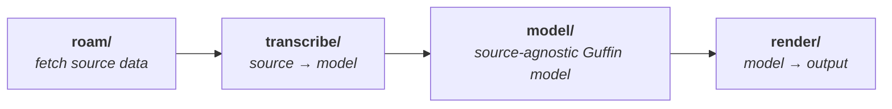
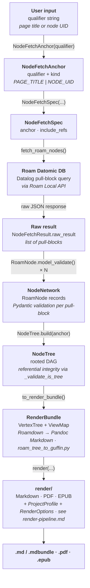

# Guffin processing pipeline

A high-level overview of how Guffin turns a Roam page or node subtree into a self-contained
document. The pipeline is a **directional flow across sub-packages**: fetch the Roam graph,
transcribe it into a normalized content model, then render that model to output.

## The pipeline at a glance

- **Fetch (`roam/`)** — a user qualifier (a page title or node UID) becomes a `NodeFetchAnchor` /
  `NodeFetchSpec`, which drives a Datalog pull-block query against the Roam Datomic DB through the
  Roam Local API. The raw results are parsed into validated `RoamNode` models and assembled into a
  `NodeTree` (a rooted DAG with referential-integrity validation).
- **Transcribe (`transcribe/`)** — `to_render_bundle()` converts the Roam-specific `NodeTree` into a
  Roam-agnostic `RenderBundle`: a `VertexTree` of normalized content paired with a `ViewMap`
  presentation overlay. Roam-flavored Markdown (Roamdown) is translated to Pandoc Markdown here.
- **Render (`render/`)** — the `RenderBundle`, together with a `ProjectProfile` (what *kind* of work)
  and `RenderOptions` (how / where to output), is rendered to Markdown, PDF, or EPUB. This stage is
  itself a two-stage Panflute → Pandoc pipeline; see [render-pipeline.md](render-pipeline.md).

The flow is one-directional and the layers don't reach back: each stage depends only on those to its
left, with `model/` as the shared content layer that `transcribe/` produces and `render/` consumes.
`transcribe/` and `render/` are siblings with **no code cross-dependency**. Orthogonal to all of
this, the `cli/` entry points orchestrate the flow and `common/` provides cross-cutting helpers.

## Detailed data flow

The artifacts that flow through the fetch and transcribe stages, ending at the `RenderBundle` that
the render layer consumes. (The render stage is expanded in [render-pipeline.md](render-pipeline.md).)

The `cli/` layer wires these together end to end: `fetch_roam_trees()` (in `cli/common.py`) runs the
fetch and transcribe stages and returns a `RenderBundle`, which `export-roam-tree` then hands to the
format-specific renderer selected by `--format`.
