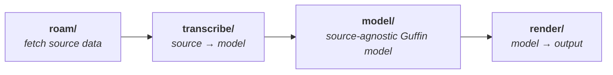
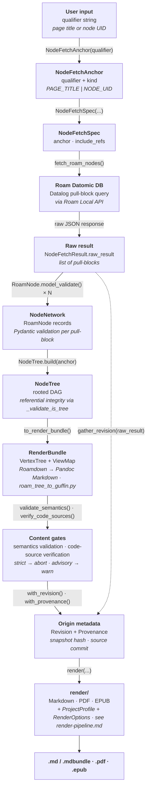

# Guffin processing pipeline

A high-level overview of how Guffin turns a Roam page or node subtree into a self-contained
document. The pipeline is a **directional flow across sub-packages**: fetch the Roam graph,
transcribe it into a normalized content model, then render that model to output.

## The pipeline at a glance

- **Fetch (`roam/`)** — a user qualifier (a page title or node UID) becomes a `NodeFetchAnchor` /
  `NodeFetchSpec`, which drives a Datalog pull-block query against the Roam Datomic DB through the
  Roam Local API. The raw results are parsed into validated `RoamNode` models and assembled into a
  `NodeTree` (a rooted DAG with referential-integrity validation).
- **Transcribe (`transcribe/`)** — `to_render_bundle()` converts the Roam-specific `NodeTree` into a
  Roam-agnostic `RenderBundle`: a `VertexTree` of normalized content paired with a `ViewMap`
  presentation overlay (each vertex's children layout, plus its *classification* — the kind of
  thinking its content represents and the channel that content arrived through). Roam-flavored
  Markdown (Roamdown) is translated to Pandoc Markdown here, and every source-specific vocabulary
  is translated into the model's own at this boundary — a Roam fence language becomes a canonical
  Linguist language id, a Better Bullets marker becomes a `Semantic` or `SourceChannel` — so no
  Roam concept reaches a renderer.
- **Render (`render/`)** — the `RenderBundle`, together with a `ProjectProfile` (what *kind* of work)
  and `RenderOptions` (how / where to output), is rendered to Markdown, PDF, or EPUB. This stage is
  itself a four-phase pipeline (model transforms → Panflute Doc → Pandoc conversion → package
  post-processing); see [render-pipeline.md](render-pipeline.md).

The flow is one-directional and the layers don't reach back: each stage depends only on those to its
left, with `model/` as the shared content layer that `transcribe/` produces and `render/` consumes.
`transcribe/` and `render/` are siblings with **no code cross-dependency**. Orthogonal to all of
this, the `cli/` entry points orchestrate the flow and `common/` provides cross-cutting helpers.

## Content gates

Between transcription and rendering the transcribed content passes through two gates, both run by
`fetch_roam_trees()` (`cli/common.py`) and both *accumulating* findings rather than failing fast:

- **Semantics validation** (`model/publishing_validation.validate_semantics`) — always runs, purely
  offline. Checks every invariant of the `guffin` attribute vocabulary over the render-visible
  document: each recognized attribute sits on one of its anchor's vertex types, each tag's value is
  a member of its enum, and the internal element numbers are well-formed, uniquely ordered, and
  nested under their numbered ancestors.
- **Code-source verification** (`cli/code_source_verification.verify_code_sources`) — networked, and
  run only when asked (`--verify-code-sources`, default on). Every `code-source::`-tagged code block
  is compared against GitHub: the URL's ref resolves to its tip commit, the immutable SHA-pinned raw
  content is fetched and sliced to the recorded line range, and a mismatch is diagnosed as *drift*
  (the source moved on) or a *local modification* (the block was edited here), with a retrieval
  failure reported as its own finding.

What a finding *means* is the caller's posture, not the gate's: `export-roam-tree` fetches with
`strict=True`, so any finding raises and aborts the export with exit 1, while `dump-roam-tree` stays
advisory — findings are logged as warnings and the dump renders regardless.

Every vertex-tree fetch also captures a `Revision` onto the bundle — a snapshot hash over the
canonical, transient-stripped wire response, Roam's own edit bookkeeping, and any authored
`revision::` name — and the CLI adds a `Provenance`, the source commit that produced the export.
Both are origin metadata the bundle merely carries; whether they surface is a renderer decision (the
colophon).

## Detailed data flow

The artifacts that flow through the fetch and transcribe stages, ending at the `RenderBundle` that
the render layer consumes. (The render stage is expanded in [render-pipeline.md](render-pipeline.md).)

The `cli/` layer wires these together end to end: `fetch_roam_trees()` (in `cli/common.py`) runs the
fetch and transcribe stages, applies both content gates under the caller's strictness posture, and
returns a revision-stamped `RenderBundle`. `export-roam-tree` then derives the output filename stem
from the content's own effective title (`deduce_out_file_stem`), resolves the `ProjectProfile` for
`--type` — letting the content refine it, so a book declaring `element-type:: part` headings becomes
a parts book (`resolve_profile`) — and hands bundle, profile, and `RenderOptions` to the
format-specific renderer selected by `--format`.
