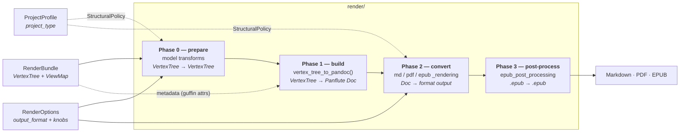

# Render pipeline & project types

How the **render** layer turns the normalized model into output, and where **project types**
(`book` vs. `article` vs. `manuscript`) fit into that.

This is the downstream companion to [processing_pipeline.md](processing_pipeline.md), which gives the
high-level overview of the whole pipeline and where the render layer sits among the sub-packages.
This doc goes deep on the *model → output* render layer and the project-type model layered on top of
it.

> Status note: the project-type model (`render/project.py`) is defined and **plumbed** — a
> `ProjectProfile` is threaded from the CLI `--type` flag through each render entry point. All four
> structural directives are applied in both paginated formats: `top_level_division` (EPUB
> `--split-level`; PDF book mode — chapter page breaks + level-1 numbering), `number_sections`,
> `emit_title_page` (PDF Bergfink `titlepage`; EPUB `--epub-title-page`), and `drop_preamble` (a
> model-side prune of the root page's loose preamble, overridable via the CLI
> `--preamble/--no-preamble`). Bibliographic **metadata** is also applied — sourced from a root
> page's `guffin`-domain attributes (see Phase 1 — metadata). `abstract` is **deferred indefinitely**. This doc
> describes both the current shape and the intended design. Sections that describe planned behavior
> are marked _(planned)_.

## The render layer is a four-phase pipeline

Every export format runs through the same core — build a format-neutral Pandoc `Doc` (Phase 1),
then convert it (Phase 2) — bracketed by two conditional phases: model transforms before the build
(Phase 0), and package post-processing after the conversion (Phase 3, EPUB only).

- **Phase 0 — prepare** (in each `render()` entry point): transforms on the `VertexTree`, before
  any Pandoc structure exists — `drop_attribute_assignments()` (the `suppress_attributes` option),
  `drop_root_preamble()` (the profile's `drop_preamble` directive, overridable via the
  `include_preamble` option), and `fetch_and_enrich_images()` (Cloud Firestore assets +
  `enrich_image_original_sizes()`).  Conditional: which transforms run depends on the options and
  the structural policy.
- **Phase 1 — build** — `render/pandoc_rendering.py::vertex_tree_to_pandoc()`: walks the
  `VertexTree`, batch-parses inline Pandoc Markdown, and builds a **format-neutral** Panflute `Doc`
  (the in-memory Pandoc AST). Shared by all formats.
- **Phase 2 — convert** — `render/{md,pdf,epub}_rendering.py`: serializes the `Doc` to Pandoc JSON
  and invokes Pandoc (plus Typst for PDF), applying the **format-specific** writer, Lua filters,
  templates, and bundled resources.
- **Phase 3 — post-process** — `render/epub_post_processing.py` (EPUB only): rewrites the packaged
  `.epub` for effects Pandoc's writer cannot be told at invocation time —
  `restore_matter_divisions()` (the CMOS `<body>` divisions) and `stamp_titlepage_provenance()`
  (the provenance colophon onto the generated title page).

## Three orthogonal inputs

A render call combines three independent things. They are kept as separate objects on purpose —
each is a different axis:

| Object | Question it answers | Module | Discriminator |
|---|---|---|---|
| `RenderBundle` | *what is the content?* | `model/render_bundle.py` | — |
| `ProjectProfile` | *what kind of work is it?* | `render/project.py` | `project_type` |
| `RenderOptions` | *how / where to output?* | `render/render_options.py` | `output_format` |

`RenderOptions` and `ProjectProfile` are **both** format-independent in their base, but that does not
make them the same kind of thing:

- `RenderOptions` base fields (`output_dir`, `cache_dir`, `dump_pandoc_ast`, `suppress_attributes`)
  are render-**operation** knobs — they only exist *because* you are rendering.
- `ProjectProfile` describes the **work itself** (its kind plus bibliographic identity), which is
  invariant across formats and across render operations. A book is a book whether you render it to
  PDF, to EPUB, or not at all.

### Why they are not merged

`output_format` (md/pdf/epub) and `project_type` (default/book/manuscript) cross-product
independently — a 3×3 space. Folding the profile into `RenderOptions` would either:

- **flatten the two discriminators** → one subclass per *combination* (`PdfBookOptions`,
  `EpubArticleOptions`, …): combinatorial explosion; or
- **nest `profile` as a field** of `RenderOptions` → a *format-specific* object would carry a
  *format-independent* thing, and rendering one work to two formats would mean specifying the
  profile twice and keeping the copies in sync.

Keeping them separate gives the correct cardinality: **one** `ProjectProfile`, **N** format options.

## Project types

`render/project.py` models the *kind of work*, adopting the **concept** from Quarto's
`project: type:` — but **no Quarto artifact**: no `_quarto.yml`, no `quarto` CLI, no extensions.
Just a native vocabulary and the structural semantics it implies, expressed as Guffin's own Pydantic
models (mirroring the `RenderOptions` discriminated-hierarchy pattern).

- `ProjectType` — `default` | `book` | `manuscript` (the discriminator).
- `ProjectProfile` — the format-independent base, with bibliographic fields
  (`title`, `authors`, `date`, `identifier`) shared by every kind of work. _Note:_ these fields are
  **not currently the metadata source** — bibliographic metadata is sourced from the content's
  `guffin`-domain attributes instead (see Phase 1 — metadata), so the profile fields are presently
  unused (a possible future fallback/override).
- Per-type subclasses — `DefaultProfile`, `BookProfile` (`with_parts`),
  `ManuscriptProfile` (`abstract`, `keywords`).
- `StructuralPolicy` — the format-independent structural directives a profile **resolves to** (via
  `profile.structural_policy`). Renderers consume this rather than branching on `ProjectType`, so the
  type→structure semantics live in one place.

| `ProjectType` | top-level division | title page | numbered | abstract | loose preamble |
|---|---|---|---|---|---|
| `default` (article) | section | no | no | no | kept |
| `book` | chapter (or part) | yes | yes | no | dropped |
| `manuscript` | section | yes | no | yes | kept |

## Where the profile is consumed

In the **render layer only** — never in `transcribe/`. Two reasons:

1. **Conceptual.** Transcription is project-type-agnostic. It produces the same `VertexTree`
   regardless of how the work will later be packaged; the book-vs-article distinction is realized at
   render time (heading→division mapping, title page, numbering).
2. **Structural.** `ProjectProfile` lives in `render/`, and `transcribe/` may not depend on
   `render/` (sibling layers). So `transcribe/` *cannot* import it — it would invert the layering.

Within `render/`, the profile's effects split across the pipeline phases: metadata is consumed in
the build (Phase 1); structure is consumed in the prepare and convert phases (Phases 0 and 2).

### Phase 1 (build) — metadata _(applied)_

The bibliographic metadata source is a root page's **`guffin`-domain attributes** — the attributes
folded from a `guffin-meta::` container block (the Guffin metadata convention). In
`vertex_tree_to_pandoc()`, `_document_metadata()` reads them and maps recognised names to
`doc.metadata`: `title` → title (**overriding** the Roam page title), `subtitle` → subtitle,
`authors` → `author` (one entry per value, so comma-separated authors become multiple), `date` →
date, `publisher` → publisher, `rights` → rights, `identifier` → identifier. Every Pandoc writer
then maps the metadata to its format natively (Typst title block; EPUB `dc:title` / `dc:creator` /
`dc:date` / `dc:publisher` / `dc:rights` / `dc:identifier`) — **the format renderers do not change
for this half.** Metadata-domain attributes never render as body pills, and any unrecognised
`guffin`-domain attribute is dropped from the output entirely. (`abstract` is deferred indefinitely.)

The **title page** shows the same fields in both paginated formats, in the same order (title,
subtitle, authors, publisher, date, rights): Pandoc's EPUB writer renders them natively on its
generated title page, while on the PDF side the bundled Bergfink template was extended to match —
`publisher` and `rights` are Guffin-authored additions to `base_cfg.typ` / `bergfink.typst` /
`titlepage.typ` (upstream Bergfink renders only title, subtitle, authors, date). `identifier` is
catalog metadata only (EPUB OPF `dc:identifier`); no format renders it on the title page.

### Phases 0 & 2 (prepare / convert) — structure _(applied)_

Three of the `StructuralPolicy` directives (`top_level_division`, `number_sections`, title page)
are **not representable in the Pandoc AST** — the AST has only `Header` elements with a level 1–6,
no "chapter," "numbered," or "title page" node. They are produced by the **writer + template at
invocation time** (Phase 2), and the mechanism differs per format:

| Policy directive | PDF (Typst / Bergfink) | EPUB (Pandoc) |
|---|---|---|
| chapters vs. sections | `-V top-level-division` → Bergfink book mode (Typst ignores `--top-level-division`) ✅ | `--split-level` ✅ |
| numbering | `-V number-sections=true` (Bergfink variable) ✅ | `--number-sections` ✅ |
| title page | `-V titlepage=true` → Bergfink `titlepage.typ` partial ✅ | `--epub-title-page=true\|false` ✅ |
| loose preamble | model prune (`drop_root_preamble`), Phase 0 ✅ | same model prune, Phase 0 ✅ |

The fourth, `drop_preamble`, *is* expressible before the AST and is applied in Phase 0 (prepare):
the root page's loose preamble (children preceding its first heading child, which belong to no
titled division) is pruned from the `VertexTree` by `model/vertex_tree.py::drop_root_preamble()`
before `vertex_tree_to_pandoc()` runs, identically in both paginated renderers. Without the prune,
a book's preamble surfaces badly: Pandoc's EPUB writer wraps the orphaned blocks in a synthetic
first chapter *titled with the document title* (duplicating the title page, and stamped
`bodymatter` ahead of the front matter), and the PDF strands them on their own page before
chapter 1. An explicit `include_preamble` render option (CLI `--preamble/--no-preamble`) overrides
the profile's directive in either direction; Markdown output is untouched (no pagination, no
prune).

So the structural half **cannot** be absorbed entirely into the build (Phase 1): the EPUB renderer
(`--split-level`) and the PDF path (a Bergfink template variable) each consult the policy. The
chapters-vs-sections distinction was the heaviest piece, since Bergfink had no chapter concept and it
had to be authored into the Typst template (below) rather than toggled with a flag.

The EPUB `--split-level` is wired: `epub_rendering._split_level_for()` maps `top_level_division` to a
Pandoc split level (valid range 1–6). Pandoc splits an EPUB into separate content files at the chosen
heading level, so the split must fall where a standalone "chapter" file begins. A book *with parts*
puts chapters at heading level 2 (parts occupy level 1) and therefore splits at level 2; every other
division keeps its top-level unit at level 1 and splits there. (Pandoc has no level-0 / "never split"
option, so an article and a book-without-parts produce the same level-1 chunking — the
section-vs-chapter distinction for those is a labelling/numbering concern, surfaced by later
increments rather than by chunking.)

`number_sections` is wired for both formats, but the lever differs: EPUB passes Pandoc's
`--number-sections` flag (the epub writer numbers headings directly), while PDF passes
`-V number-sections=true` — Bergfink reads numbering from its own `number-sections` variable, and
the `--number-sections` *flag* does not set it. Both derive the boolean from
`profile.structural_policy.number_sections`, subject to the tri-state `number_sections` render
option (CLI `--numbering/--no-numbering`; `None` defers to the profile, an explicit value turns
all heading numbering on or off). On the PDF side the template-applying args are built
once by `pdf_rendering._typst_template_args()` and shared with the `GUFFIN_DUMP_TYPST` dump, so the
dumped Typst always matches the produced PDF.

`top_level_division` is wired for PDF too, modelled on the EPUB book output. When the division is not
`SECTION`, `pdf_rendering` passes `-V top-level-division=<chapter|part>`, which activates a book-mode
block in `bergfink.typst` (gated on that variable, so the default `SECTION` render emits no new Typst
and stays byte-identical). Book mode adds a `pagebreak(weak: true)` before every level-1 heading — so
the top division opens on a new page, the print analogue of EPUB splitting at the top level — and,
when the division is `part`, before every level-2 heading as well, since that is where a parts book's
chapters live (the analogue of the EPUB `--split-level=2`). When numbering is on, book mode also
overrides heading numbering with a hierarchical join (`1`, `1.1`, `1.1.1`) starting at level 1,
matching Pandoc's EPUB numbering. (The bundled `user_cfg.typ` otherwise starts numbering at level 2,
which is why an un-booked `--type book` PDF left its top-level headings unnumbered.) The parts book
is selected by the content itself: `cli/common.resolve_profile` upgrades a `--type book` export to
`BookProfile(with_parts=True)` when `model/guffin_semantics.has_parts()` finds a level-1 heading tagged
`element-type:: part` — the structure is declared once, in the Roam source, not restated as a flag.

### Summary

| Directive / data (source) | Phase | Consumed in | Format renderers change? |
|---|---|---|---|
| `title`, `subtitle`, `authors`, `date`, `publisher`, `rights`, `identifier` (**content**: `guffin`-domain attributes — not the profile's unused bibliographic fields) | 1 (build) ✅ | `pandoc_rendering._document_metadata` | no (Bergfink title page extended for `publisher`/`rights`) |
| `top_level_division`, `number_sections` (+ `number_sections` option override), title page (profile policy) | 2 (convert) ✅ | `pdf` / `epub` renderers + Bergfink template | yes (minimal) |
| `drop_preamble` (+ `include_preamble` option override) (profile policy) | 0 (prepare) ✅ | `pdf` / `epub` renderers → `drop_root_preamble` model prune | yes (minimal) |
| `emit_abstract` (profile policy; `ManuscriptProfile.abstract`/`keywords`) | — | nothing — **deferred indefinitely** | — |

## The `GuffinSemantics` vocabulary (model → format mapping)

> **Status.** The vocabulary lives in `model/guffin_semantics.py`; the **EPUB** mapping that consumes
> it (`render/epub_semantics.py` + the `pandoc_rendering` header stamping) is **built**, including the
> `<body>` division post-processing (`render/epub_post_processing.py`) that restores the CMOS placement.
> Two vocabulary-driven effects are already **format-independent**: the matter-derived `unnumbered`
> numbering exemption (stamped in the shared Doc build; honored by both paginated formats) and parts
> detection (`has_parts` → the PART division's pagination). The **per-element** `→ PDF/Typst` and
> `→ GFM` maps (the analogue of the EPUB `epub:type` map) are still future work.

`model/guffin_semantics.py` defines a **format-independent vocabulary aligned with publishing-industry
standards and conventions** — the semantic identity of the pieces of a document, independent of how
any output format renders them. It is intentionally *not* modeled on EPUB (or PDF, or GFM).

### The pieces

- **`GuffinAttribute`** — an `Attribute` pinned to the `guffin` domain, carrying an **`Anchor`**: the
  kind of vertex it attaches to. `Anchor` has `PAGE` and `HEADING`, and each member carries the
  `VertexType` it corresponds to (the Anchor↔VertexType correspondence is a single source of truth on
  the enum; `VertexType` is defined in `model/vertex.py`).
- **`GuffinSemantics`** — the enum of recognized guffin attributes, each a `GuffinAttribute`:
  - *Page-anchored document metadata* (`Anchor.PAGE`): `TITLE`, `SUBTITLE`, `AUTHORS`, `DATE`,
    `PUBLISHER`, `RIGHTS`, `IDENTIFIER` — bibliographic facts, folded from a `guffin-meta::` block
    on the root page.
  - *Heading-anchored tags* (`Anchor.HEADING`): `ELEMENT_TYPE` (`element-type::`) declares which
    `StructuralElement` a heading is; `MATTER` (`matter::`) declares its `Matter` division directly,
    for a bespoke heading with no specific element type.
- **`StructuralElement`** — the legal values of an `element-type` tag: a book's organizational parts
  (`TITLE_PAGE` … `COLOPHON`, incl. `PART`/`CHAPTER`/`SECTION`/`SUB_SECTION`/`SUB_SUB_SECTION`; no `cover`
  — per CMOS only the interior is matter-classified, the cover being exterior). Each member
  carries its **`Matter`** — the `front-matter`/`body-matter`/`back-matter` division it belongs to.
  This is the **conventional** placement, aligned with the **Chicago Manual of Style (CMOS)** and
  independent of any output format (e.g. `conclusion`/`epilogue` are body matter, `afterword` opens
  the back matter). How a given format's toolchain actually divides these parts is a separate concern,
  recorded per-format in `render/` (for EPUB, on `EpubType.division`; see below).
- **`element_type_of(assignment)` / `matter_of(assignment)`** — read an `element-type` / `matter`
  assignment's sole value and coerce it to a `StructuralElement` / `Matter` (rejecting non-members);
  each enum *is* the spec of its legal values.
- **`find_guffin_attribute(vertex, attribute)`** — a vertex's assignment for a `GuffinSemantics`
  attribute (the Guffin domain supplied automatically).
- **`has_parts(tree)`** — whether a `VertexTree` structures its top level as parts: any level-1
  heading tagged `element-type:: part`. The vocabulary's structure-detection entry point — it drives
  `BookProfile.with_parts` (via `cli/common.resolve_profile`), and with it the PART division's
  pagination in both paginated formats.
- **`validate_semantics(tree)`** — the vocabulary's validation pass (built on `common/validation`),
  accumulating four validators: `all_attributes_anchored` (every recognized guffin attribute sits
  on the vertex type its `Anchor` names — the `Anchor.vertex_type` correspondence is the enforced
  invariant), `all_element_type_values_legal` / `all_matter_values_legal` (every `element-type` /
  `matter` value is a `StructuralElement` / `Matter` member), and `all_matter_tags_level_1` (a
  `matter` tag applies to level-1 headings only). Run by `cli/common.fetch_roam_trees` on the
  transcribed content; violations are logged as warnings — advisory, never fatal — since a
  misplaced or illegal tag simply has no effect on the output.

Member **names follow publishing labels** (`table-of-contents`, `list-of-illustrations`,
`about-the-author`), some of which deliberately diverge from any one format's terms — e.g. EPUB's
Structural Semantics Vocabulary abbreviates `table-of-contents`/`list-of-illustrations` to
`toc`/`loi`. That divergence is by design: the model speaks the publishing domain, and the render
layer translates. (Where a publishing label and a format term happen to coincide — `acknowledgments`,
`appendix`, `colophon` — no translation is needed; the member-keyed map still routes them explicitly.)

### How it maps to output (the design contract)

- Everything in `model/guffin_semantics.py` lives in `model/` with **zero render/format dependency**
  (it depends only on the `model/` structural primitives — `attribute.py`, `vertex.py`,
  `vertex_tree.py` — sitting at the top of that stack).
- Every per-format mapping lives in `render/`, as an **explicit map keyed on the model member** —
  never a name-equality lookup against the format's own vocabulary. Some members have no counterpart
  in a given format (and vice-versa), so the map is deliberately partial.
- **EPUB — done.** `render/epub_semantics.py::epub_type_for()` is the explicit `StructuralElement →
  EpubType` map (e.g. `COLOPHON → EpubType.COLOPHON`, `TABLE_OF_CONTENTS → EpubType.TOC`,
  `None` for elements with no EPUB term). During Doc construction, `pandoc_rendering._heading_semantics`
  uses a heading's `element-type` / `matter` tags to (a) stamp `epub:type` on the section header and
  (b) add the `unnumbered` class to any non-body-matter section, so only body-matter chapters are
  numbered — the class is stamped in the shared Doc build, so the exemption holds in **both**
  paginated formats (Pandoc's `--number-sections` for EPUB, the Typst writer for PDF), not just
  EPUB. A bare `matter::` tag **overrides** the element's default matter
  (logging any disagreement), letting an author place a bespoke or non-standard section. The
  `epub:type` rides along harmlessly in the other formats (GFM drops it, Typst ignores it).
  - **`EpubType.division` records Pandoc, not CMOS.** Whereas `StructuralElement.matter` is the CMOS
    placement (see above), each `EpubType.division` records the `<body epub:type>` division **Pandoc
    assigns that term out of the box** — verified empirically against Pandoc 3.8.3's output (Pandoc
    classifies only its own hardcoded subset and defaults the rest to `bodymatter`). The two are
    intentionally different reference points; their **divergence set** — currently `epigraph`,
    `introduction`, `table-of-contents`, `list-of-illustrations`, `prologue`, `afterword`, `glossary`,
    `endnotes` (flagged inline in `epub_semantics.py`) — is exactly what the `<body>` division
    post-processing (below) corrects. A characterization test (`test_epub_semantics.py`) re-derives
    `EpubType.division` from a live Pandoc run so any change in Pandoc's classification is caught.
  - **`<body>` division post-processing — done.** `pandoc_rendering._heading_semantics` stamps every
    matter-tagged heading with its CMOS division in a `data-guffin-matter` section attribute (mapped
    from `Matter` by `epub_semantics.epub_division_for_matter`); after Pandoc packages the EPUB,
    `render/epub_post_processing.py::restore_matter_divisions` rewrites each content document's `<body
    epub:type>` to that stamped division and strips the scaffold attribute. This is driven by the
    heading's **`Matter`**, not its `epub:type`, so it also corrects bespoke `matter::` sections that
    carry no `epub:type` (e.g. a matter-only "Who is this Book for?"). It is `<body>`-level metadata,
    invisible in Apple Books, but makes the package's structural semantics conformant.
- **PDF / GFM — partially reached, per-element maps future.** The tags already drive two
  format-independent effects in PDF: the matter-derived `unnumbered` exemption (above) and, via
  `has_parts` → the PART division, part/chapter pagination. What remains future is the
  **per-element** sibling map (`StructuralElement → PDF/Typst`, `→ GFM`) — the analogue of
  `epub_type_for`, letting an element's identity drive format-specific styling/placement. (The
  `data-guffin-matter`/`epub:type` scaffolding rides along harmlessly meanwhile — GFM drops it,
  Typst ignores it.)

## Status & next steps

The project-type model, structural effects, bibliographic metadata, and structural-element tagging
described above are all built; what remains:

1. **Possible refinements.** PDF book mode now distinguishes PART from CHAPTER for pagination
   (a parts book breaks pages at chapters too), but numbering still runs hierarchically from
   level 1 in both — a parts book numbers its parts `1`, `2`, … rather than `I`, `II`, … with
   chapters numbered continuously. (`abstract` is deferred indefinitely.)
2. **Per-element format maps.** The `StructuralElement → PDF/Typst` and `→ GFM` sibling maps (the
   analogue of the EPUB `epub_type_for`), letting an element's identity drive format-specific
   styling/placement; see the `GuffinSemantics` vocabulary section above.
