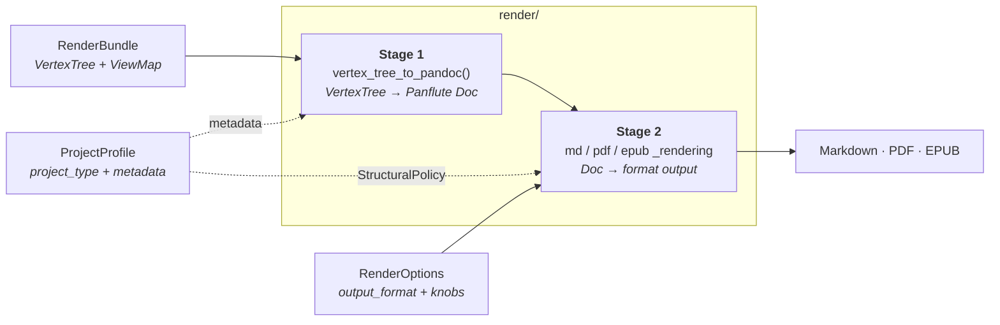

# Render pipeline & project types

How the **render** layer turns the normalized model into output, and where **project types**
(`book` vs. `article` vs. `manuscript`) fit into that.

This is the downstream companion to [processing_pipeline.md](processing_pipeline.md), which gives the
high-level overview of the whole pipeline and where the render layer sits among the sub-packages.
This doc goes deep on the *model → output* render layer and the project-type model layered on top of
it.

> Status note: the project-type model (`render/project.py`) is defined and **plumbed** — a
> `ProjectProfile` is threaded from the CLI `--type` flag through each render entry point. The first
> structural effect is applied: EPUB derives its `--split-level` from `top_level_division`. The
> remaining structural effects (PDF chapters, numbering, title page) and all metadata effects are
> **not yet applied**. This doc describes both the current shape and the intended design so the
> remaining wiring has a spec to follow. Sections that describe planned behavior are marked
> _(planned)_.

## The render layer is a two-stage pipeline

Every export format goes through the same two stages:

- **Stage 1 — `render/pandoc_rendering.py::vertex_tree_to_pandoc()`**: walks the `VertexTree`,
  batch-parses inline Pandoc Markdown, and builds a **format-neutral** Panflute `Doc` (the in-memory
  Pandoc AST). Shared by all formats.
- **Stage 2 — `render/{md,pdf,epub}_rendering.py`**: serializes the `Doc` to Pandoc JSON and invokes
  Pandoc (plus Typst for PDF), applying the **format-specific** writer, Lua filters, templates, and
  bundled resources.

## Three orthogonal inputs

A render call combines three independent things. They are kept as separate objects on purpose —
each is a different axis:

| Object | Question it answers | Module | Discriminator |
|---|---|---|---|
| `RenderBundle` | *what is the content?* | `model/render_bundle.py` | — |
| `ProjectProfile` | *what kind of work is it?* | `render/project.py` | `project_type` |
| `RenderOptions` | *how / where to output?* | `render/render_options.py` | `output_format` |

`RenderOptions` and `ProjectProfile` are **both** format-independent in their base, but that does not
make them the same kind of thing:

- `RenderOptions` base fields (`output_dir`, `cache_dir`, `dump_pandoc_ast`, `suppress_attributes`)
  are render-**operation** knobs — they only exist *because* you are rendering.
- `ProjectProfile` describes the **work itself** (its kind plus bibliographic identity), which is
  invariant across formats and across render operations. A book is a book whether you render it to
  PDF, to EPUB, or not at all.

### Why they are not merged

`output_format` (md/pdf/epub) and `project_type` (default/book/manuscript) cross-product
independently — a 3×3 space. Folding the profile into `RenderOptions` would either:

- **flatten the two discriminators** → one subclass per *combination* (`PdfBookOptions`,
  `EpubArticleOptions`, …): combinatorial explosion; or
- **nest `profile` as a field** of `RenderOptions` → a *format-specific* object would carry a
  *format-independent* thing, and rendering one work to two formats would mean specifying the
  profile twice and keeping the copies in sync.

Keeping them separate gives the correct cardinality: **one** `ProjectProfile`, **N** format options.

## Project types

`render/project.py` models the *kind of work*, adopting the **concept** from Quarto's
`project: type:` — but **no Quarto artifact**: no `_quarto.yml`, no `quarto` CLI, no extensions.
Just a native vocabulary and the structural semantics it implies, expressed as Guffin's own Pydantic
models (mirroring the `RenderOptions` discriminated-hierarchy pattern).

- `ProjectType` — `default` | `book` | `manuscript` (the discriminator).
- `ProjectProfile` — the format-independent base, carrying bibliographic metadata
  (`title`, `authors`, `date`, `identifier`) shared by every kind of work.
- Per-type subclasses — `DefaultProfile`, `BookProfile` (`with_parts`),
  `ManuscriptProfile` (`abstract`, `keywords`).
- `StructuralPolicy` — the format-independent structural directives a profile **resolves to** (via
  `profile.structural_policy`). Renderers consume this rather than branching on `ProjectType`, so the
  type→structure semantics live in one place.

| `ProjectType` | top-level division | title page | numbered | abstract |
|---|---|---|---|---|
| `default` (article) | section | no | no | no |
| `book` | chapter (or part) | yes | yes | no |
| `manuscript` | section | yes | no | yes |

## Where the profile is consumed

In the **render layer only** — never in `transcribe/`. Two reasons:

1. **Conceptual.** Transcription is project-type-agnostic. It produces the same `VertexTree`
   regardless of how the work will later be packaged; the book-vs-article distinction is realized at
   render time (heading→division mapping, title page, numbering).
2. **Structural.** `ProjectProfile` lives in `render/`, and `transcribe/` may not depend on
   `render/` (sibling layers). So `transcribe/` *cannot* import it — it would invert the layering.

Within `render/`, the profile's effects split across the two stages.

### Stage 1 — metadata _(planned)_

The **bibliographic** fields (`title`, `authors`, `date`, `identifier`, `abstract`) become
`doc.metadata` on the Panflute `Doc` in `vertex_tree_to_pandoc()`. Every Pandoc writer then maps the
metadata to its format natively (LaTeX/Typst title block, EPUB `dc:*`, the `abstract` template
variable). **The format renderers do not change for this half.**

### Stage 2 — structure _(planned)_

The `StructuralPolicy` directives (`top_level_division`, `number_sections`, title page) are **not
representable in the Pandoc AST** — the AST has only `Header` elements with a level 1–6, no
"chapter," "numbered," or "title page" node. They are produced by the **writer + template at
invocation time**, and the mechanism differs per format:

| Policy directive | PDF (Typst / Bergfink) | EPUB (Pandoc) |
|---|---|---|
| chapters vs. sections | Bergfink template variable (Typst ignores `--top-level-division`) | `--split-level` ✅ |
| numbering | template / `--number-sections` | `--number-sections` |
| title page | Bergfink `titlepage.typ` partial | auto-generated from metadata |

So the structural half **cannot** be absorbed entirely into stage 1: at minimum the EPUB renderer
(`--split-level`) and the PDF path (a Bergfink template variable) must consult the policy. The
heaviest single piece is teaching the Bergfink Typst template a "book mode," which is template work,
separate from the Python wiring.

The EPUB `--split-level` is wired: `epub_rendering._split_level_for()` maps `top_level_division` to a
Pandoc split level (valid range 1–6). Pandoc splits an EPUB into separate content files at the chosen
heading level, so the split must fall where a standalone "chapter" file begins. A book *with parts*
puts chapters at heading level 2 (parts occupy level 1) and therefore splits at level 2; every other
division keeps its top-level unit at level 1 and splits there. (Pandoc has no level-0 / "never split"
option, so an article and a book-without-parts produce the same level-1 chunking — the
section-vs-chapter distinction for those is a labelling/numbering concern, surfaced by later
increments rather than by chunking.)

### Summary

| Profile data | Stage | Consumed in | Format renderers change? |
|---|---|---|---|
| `title`, `authors`, `date`, `identifier`, `abstract` | 1 (metadata) | `pandoc_rendering` | no |
| `top_level_division`, `number_sections`, title page | 2 (structure) | `pdf` / `epub` renderers + Bergfink template | yes (minimal) |

## Status & next steps

1. **Plumbing — done.** `render/project.py` defines the model and `profile_for()` maps a
   `ProjectType` to its default-valued profile. The CLI exposes `--type default|book|manuscript`
   (parallel to `--format`, default `default`), and each render entry point
   (`render/{md,pdf,epub}_rendering.py::render`) now takes a `profile: ProjectProfile` argument,
   threaded through `cli/export_roam_tree.py::_render`. Nothing reads `StructuralPolicy` to shape
   output yet — the renderers currently only log it.
2. **First behavior — EPUB split-level done.** `epub_rendering` derives `--split-level` from
   `top_level_division` (`_split_level_for()`): a parts-based book splits at level 2, everything else
   at level 1. The PDF Bergfink "book mode" (chapters vs. sections) is the next, visually-compelling
   increment — and the heaviest, since Typst ignores `--top-level-division` and the switch lives in
   the template.
3. Title page / numbering / abstract follow as later increments.
