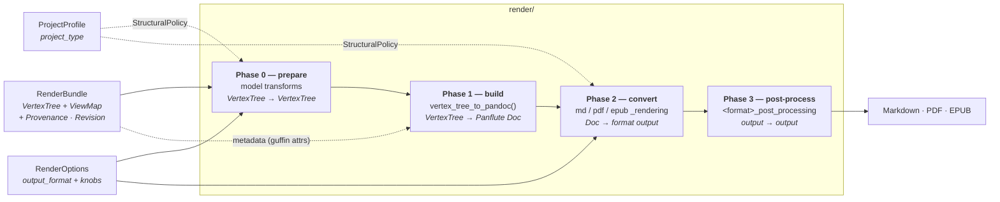

# Render pipeline & project types

How the **render** layer turns the normalized model into output, and where **project types**
(`book` vs. `article` vs. `manuscript`) fit into that.

This is the downstream companion to [processing_pipeline.md](processing_pipeline.md), which gives the
high-level overview of the whole pipeline and where the render layer sits among the sub-packages.
This doc goes deep on the *model → output* render layer and the project-type model layered on top of
it.

## The render layer is a four-phase pipeline

Every export format runs through the same core — build a format-neutral Pandoc `Doc` (Phase 1),
then convert it (Phase 2) — bracketed by two conditional phases: model transforms before the build
(Phase 0), and output post-processing after the conversion (Phase 3, conditional per format).

- **Phase 0 — prepare** (in each `render()` entry point): transforms on the `VertexTree`, before
  any Pandoc structure exists. All three renderers apply the same sequence in the same order —
  `drop_unpublished()` (always first: prunes every `publish:: false` vertex with its whole subtree,
  embeds of pruned content vanishing with it), `drop_attribute_assignments()` (the
  `suppress_attributes` option), `strip_element_numbers()` (unless `emit_element_numbers` — a
  heading's `[1.2.3]` lead is authoring bookkeeping, not content, so exported output hides it by
  default), `drop_code_sources()` (unless `emit_code_sources` — clears each code block's provenance
  so no attribution line renders), `drop_page_breaks()` (the profile's `honor_page_breaks`
  directive, when it declines), `promote_non_body_sections()` (parts books only), and
  `fetch_and_enrich_assets()` (Cloud Firestore assets + `enrich_image_original_sizes()` /
  `enrich_pdf_original_file_names()`); the two paginated renderers additionally apply
  `drop_root_preamble()` (the profile's `drop_preamble` directive, overridable via the
  `include_preamble` option). Conditional: which transforms run depends on the options and the
  structural policy.
- **Phase 1 — build** — `render/pandoc_rendering.py::vertex_tree_to_pandoc()`: walks the
  `VertexTree`, batch-parses inline Pandoc Markdown, and builds a **format-neutral** Panflute `Doc`
  (the in-memory Pandoc AST). Shared by all formats.
- **Phase 2 — convert** — `render/{md,pdf,epub}_rendering.py`: serializes the `Doc` to Pandoc JSON
  and invokes Pandoc (plus Typst for PDF), applying the **format-specific** writer, Lua filters,
  templates, and bundled resources.
- **Phase 3 — post-process** — `render/<format>_post_processing.py`: transforms a format's rendered
  **output** for effects Pandoc's writer cannot be told to produce at invocation time. **Policy —
  post-processing isolation:** all of a format's post-processing lives in its own
  `<format>_post_processing.py` module (never inline in the renderer), and a format with none omits
  the module (enforced by `tests/test_architecture.py::TestPostProcessingSegregation`; see the
  CLAUDE.md architecture rule). EPUB (`epub_post_processing.py`) rewrites the packaged `.epub` —
  `restore_matter_divisions()` (CMOS `<body>` divisions), `bake_code_line_numbers()`, and the
  title-page stamps (`stamp_titlepage_provenance` / `_revision` / `_illustrators`). Markdown
  (`md_post_processing.py`) strips Pandoc's `<!-- -->` list-separator comments from the GFM. PDF has
  none. Pre-conversion `Doc` rewrites (e.g. `pdf_rendering._apply_pdf_embeds`) are Phase 1, not
  post-processing.

## Three orthogonal inputs

A render call combines three independent things. They are kept as separate objects on purpose —
each is a different axis:

| Object | Question it answers | Module | Discriminator |
|---|---|---|---|
| `RenderBundle` | *what is the content?* | `model/render_bundle.py` | — |
| `ProjectProfile` | *what kind of work is it?* | `render/project.py` | `project_type` |
| `RenderOptions` | *how / where to output?* | `render/render_options.py` | `output_format` |

`RenderOptions` and `ProjectProfile` are **both** format-independent in their base, but that does not
make them the same kind of thing:

- `RenderOptions` base fields (`output_dir`, `cache_dir`, `dump_pandoc_ast`, `suppress_attributes`,
  `emit_colophon`, `emit_element_numbers`, `emit_code_sources`, `daily_note_format`)
  are render-**operation** knobs — they only exist *because* you are rendering.
- `ProjectProfile` describes the **work itself** (its kind plus bibliographic identity), which is
  invariant across formats and across render operations. A book is a book whether you render it to
  PDF, to EPUB, or not at all.

The bundle also carries the **origin metadata** captured upstream — a `Provenance` (the source
commit that produced the export) and a `Revision` (the content snapshot it was produced from). The
split follows the same logic: the *data* travels with the content on the bundle, while
`emit_colophon` — whether a renderer stamps it, and the placement rules per format — is a
render-operation knob on `RenderOptions`.

### Why they are not merged

`output_format` (md/pdf/epub) and `project_type` (default/book/manuscript) cross-product
independently — a 3×3 space. Folding the profile into `RenderOptions` would either:

- **flatten the two discriminators** → one subclass per *combination* (`PdfBookOptions`,
  `EpubArticleOptions`, …): combinatorial explosion; or
- **nest `profile` as a field** of `RenderOptions` → a *format-specific* object would carry a
  *format-independent* thing, and rendering one work to two formats would mean specifying the
  profile twice and keeping the copies in sync.

Keeping them separate gives the correct cardinality: **one** `ProjectProfile`, **N** format options.

## Children layout: how `children_view_type` is interpreted

Roam records a per-block presentation choice in the `:children/view-type` prop (bullet / document /
numbered). Transcription carries it into the presentation half of the `RenderBundle`: the sparse
`ViewMap` holds a `VertexView` for **every fetched node that records one** — an explicit children
view type, a bullet kind, or a provenance badge — anchor-subtree nodes and referenced nodes alike,
and an explicit `bullet` is recorded distinctly from an unset node. `children_layout` is the layout
half of that view (the classification half is the next section). At render time the rules below turn
that sparse map into each vertex's **effective**
`children_view_type`. They are simple, and they apply **uniformly** — to children of the tree root
and to children transcluded through embeds; the tri-state logic is always in play:

- All children are rendered according to the *effective* `children_view_type` of their **parent**.
- The *effective* `children_view_type` of any vertex is:
  1. the value **explicitly assigned** to that vertex in the `ViewMap`;
  2. **OR**, if there is no explicit assignment, the value **inherited from its parent**;
  3. **OR**, if there is no explicit assignment and it has no parent, the **default**
     (`DEFAULT_CHILDREN_LAYOUT`, i.e. `bullet` — Roam's own default rendering).
- The parent of a tree transcluded via an embed (**block or page**) is the **embed vertex that
  transcludes it** — the `VertexLink` container — *not* the parent the transcluded tree has on its
  original host page. Inheritance flows through the embed site: an embed under a
  `document`-layout section carries `document` into the transcluded content unless the transcluded
  vertices declare their own explicit values.

The resolution is a render-layer policy (`pandoc_rendering._effective_layout`, applied per vertex
as the render recursion descends — per transclusion *site*, so the same target embedded from two
places can inherit two different layouts), independent of the data source; the `ViewMap` stays
sparse and authored-only so that *explicit* and *inherited* never get conflated in the model.

## Classification: semantic bullets and source badges

The other half of a `VertexView` classifies the vertex itself rather than laying out its children:
a `Semantic` (the kind of thinking the content performs — definition, leads-to, result, question, …)
and a `SourceChannel` (the medium it arrived through — calendar event, email, Slack, …). Both are
declared in the source — today, the Better Bullets Roam extension's block properties — and
translated into the model's own vocabulary at transcription, so the render layer never sees the
extension.

The glyph each member renders as is declared once, in `render/semantic_theme.py`
(`BULLET_GLYPH_BY_SEMANTIC`, `BADGE_GLYPH_BY_SOURCE_CHANNEL`, `DEFAULT_BULLET_GLYPH`) — the
classification counterpart of `callout_theme.py`'s colour palette, so one classification looks the
same in every format.

Phase 1 renders the two at deliberately different depths:

- a **source channel** is decoration: its badge glyph simply leads the item's inline content
  (recognized *after* a whole-line background-colour span, so a badge decorates a coloured line
  rather than defeating its recognition);
- a **semantic** replaces the item's *marker*, which the Pandoc AST cannot express — a `BulletList`
  item has no marker node. So the build wraps the item's own body (children excluded, so the
  classification decorates that one line) in a scaffold `Div` carrying `data-guffin-semantic` and
  `data-guffin-semantic-glyph`, and each format's `*_bullet.lua` filter maps that scaffold to its
  own ceiling in Phase 2:

| Format | Mapping |
|---|---|
| Markdown (GFM) | the glyph is prepended to the item's line, behind the native `-` marker — Markdown's syntax ceiling, since a list marker is not addressable |
| PDF (Typst) | the list is rewritten as a raw two-column Typst grid, glyph in the first column, set 20% larger than the item text so the marker reads at a glance |
| EPUB | the list is wrapped in a `Div.semantic-bullets` whose native markers `epub.css` suppresses (`list-style: none` — no `::marker` and no `:has()`, neither supported by the Kindle app's renderer), each item led by a `bullet-glyph` span |

In every format an unclassified item sharing a list with classified siblings gets
`DEFAULT_BULLET_GLYPH` (`•`), so the run stays visually one uniform list.

## REFERENCE vs. EMBED: the transclusion line

The two `VertexLinkKind`s (`model/vertex_link.py`) draw a hard line that every render path
must respect:

- **REFERENCE** (`x-guffin:vertex/<uid>`) includes **only the target vertex** — the `Vertex`
  at the end of the `VertexLink` — plus whatever the target needs to render as itself:
  content already folded into the vertex's own fields (a `TableVertex`'s rows, a
  `CalloutVertex`'s body, a `QuoteBlockVertex`'s attribution) and, for an `AssetVertex`, its
  fetched file. A reference **never transcludes the target's descendants** — neither its
  `children` subtree nor its folded `attribute_assignments` (which originate as child
  vertices).
- **EMBED** (`x-guffin:vertex-embed/<uid>`) does **full transclusion**: the target and its
  whole descendant subtree are reproduced at the embed site, embeds inside transcluded
  content followed recursively (cycles terminate). Transclusion reaches only vertices
  present in the `VertexTree` — tree and referenced vertices alike — so it is bounded by
  the tree's content horizon: an embed whose target is absent from the tree degrades
  rather than transcludes.

The line holds across both rendering shapes a reference can take:

- **Inline path** (`make_resolver`): a reference to an inline-representable target
  (`PageVertex`, `HeadingVertex`, `TextVertex`) renders the target's own converted text —
  title, heading text, body text — never its children.
- **Block-level path** (`_block_ref_target` / `build_child_blocks`): a `TextVertex` that is
  a *standalone* reference to a block-level target (`ImageVertex`, `PdfVertex`,
  `CodeBlockVertex`, `CalloutVertex`, `QuoteBlockVertex`, `TableVertex`) renders as the
  referenced block itself — a fidelity accommodation for targets that have no faithful
  inline form, **not** a transclusion. The target is rendered stripped of its `children`
  and folded `attribute_assignments`.
- **Cell image path** (`_table_vertex_to_blocks`): a table cell that is a *standalone*
  reference to an `ImageVertex` (per `model/vertex_tree.standalone_link_target_of_text`)
  renders the referenced image in the cell — the cell-level twin of the block-level path,
  kind-agnostic (`REFERENCE` and `EMBED` alike), scoped to images only. Any other cell
  renders as its parsed inline content.

The same line scopes semantics: `transcluded_vertices()` (the render-visible set that
`assignments_for`, `has_parts`, and the element-number validators walk) includes
embed-transcluded content and excludes merely-referenced vertices — consistent with what each
kind renders.

It also scopes **asset fetching**: `render/asset_fetch.fetch_assets` fetches exactly the assets
the rendered document places from local files — `model/vertex_tree.visible_asset_vertices()`
(render-visible asset vertices, plus targets of the block-level standalone-reference path and
of standalone image-referencing table cells, recognized by
`model/vertex_link.parse_standalone_vertex_link`) together with the root's cover
image. An asset
merely *mentioned* — linked inline amid surrounding text, in body text or a table cell —
renders as a remote hyperlink and is
never downloaded, so a `.mdbundle` carries no orphan files for content that only mentions
foreign pages.

## Project types

`render/project.py` models the *kind of work*, adopting the **concept** from Quarto's
`project: type:` — but **no Quarto artifact**: no `_quarto.yml`, no `quarto` CLI, no extensions.
Just a native vocabulary and the structural semantics it implies, expressed as Guffin's own Pydantic
models (mirroring the `RenderOptions` discriminated-hierarchy pattern).

- `ProjectType` — `default` | `book` | `manuscript` (the discriminator).
- `ProjectProfile` — the format-independent base, with bibliographic fields
  (`title`, `authors`, `date`, `identifier`) shared by every kind of work. _Note:_ these fields are
  not the metadata source — bibliographic metadata is sourced from the content's
  `guffin`-domain attributes instead (see Phase 1 — metadata), so the profile fields are unused.
- Per-type subclasses — `DefaultProfile`, `BookProfile` (`with_parts`),
  `ManuscriptProfile` (`abstract`, `keywords`).
- `StructuralPolicy` — the format-independent structural directives a profile **resolves to** (via
  `profile.structural_policy`). Renderers consume this rather than branching on `ProjectType`, so the
  type→structure semantics live in one place. Each directive is a statement about the *work*, not a
  guarantee about any particular output: a renderer maps directives onto the mechanisms its format
  offers, and the mapping is deliberately partial (mirroring the partial `StructuralElement →
  EpubType` map). The two paginated formats express all six live directives (`emit_abstract` is
  declared on the policy but no renderer expresses it yet); the Markdown renderer
  expresses only `emit_title_page` — an unpaginated interchange document has no title *page*, page
  breaks, or generated ToC (its consumers — GitHub, Typora — provide their own outline
  affordances), so the directive maps to the format's bibliographic record instead: the GFM
  conversion runs standalone and Pandoc serializes the document metadata (title, authors,
  publisher, …) as a YAML front-matter block ahead of the body, with the title also rendered as
  the leading H1. Markdown is also the one format whose title shares a namespace with the content
  headings, so whenever a title H1 is emitted (every profile, not just title-page-emitting ones)
  the content headings are demoted one level — `# Title`, `## Chapter` — clamped at H6; the
  model's normalized levels (shallowest heading = 1) are untouched, so the paginated formats and
  the semantics vocabulary are unaffected.

| `ProjectType` | top-level division | title page | generated ToC | numbered | abstract | loose preamble | authored page breaks |
|---|---|---|---|---|---|---|---|
| `default` (article) | section | no | no | no | no | kept | honored |
| `book` | chapter (or part) | yes | yes | yes | no | dropped | dropped |
| `manuscript` | section | yes | no | no | yes | kept | honored |

## Where the profile is consumed

In the **render layer only** — never in `transcribe/`. Two reasons:

1. **Conceptual.** Transcription is project-type-agnostic. It produces the same `VertexTree`
   regardless of how the work will later be packaged; the book-vs-article distinction is realized at
   render time (heading→division mapping, title page, numbering).
2. **Structural.** `ProjectProfile` lives in `render/`, and `transcribe/` may not depend on
   `render/` (sibling layers). So `transcribe/` *cannot* import it — it would invert the layering.

Within `render/`, the profile's effects split across the pipeline phases: metadata is consumed in
the build (Phase 1); structure is consumed in the prepare and convert phases (Phases 0 and 2).

### Phase 1 (build) — metadata

The bibliographic metadata source is a root page's **`guffin`-domain attributes** — the attributes
folded from a `guffin-meta::` container block (the Guffin metadata convention). In
`vertex_tree_to_pandoc()`, `_document_metadata()` reads them and maps recognised names to
`doc.metadata`: `title` → title (**overriding** the Roam page title), `subtitle` → subtitle,
`authors` → `author` (one entry per value, so comma-separated authors become multiple), `date` →
date, `publisher` → publisher, `rights` → rights, `identifier` → identifier, `language` → `lang`
(Pandoc's canonical IETF BCP 47 language variable), `description` → description, `illustrators` →
`contributor` (structured `{role: illustrator, text}` entries — supportive contributors, not
co-creators; the EPUB writer emits `dc:contributor` refined with the MARC relator `ill`). Every Pandoc writer
then maps the metadata to its format natively (Typst title block; EPUB `dc:title` / `dc:creator` /
`dc:date` / `dc:publisher` / `dc:rights` / `dc:identifier` / `dc:language` / `dc:description`) —
**the format renderers do not change for this half.** Metadata-domain attributes never render as body pills, and any unrecognised
`guffin`-domain attribute is dropped from the output entirely.

The **title page** shows the same fields in both paginated formats, in the same order (title,
subtitle, authors, publisher, date, rights): Pandoc's EPUB writer renders them natively on its
generated title page, while on the PDF side the bundled Bergfink template was extended to match —
`publisher` and `rights` are Guffin-authored additions to `base_cfg.typ` / `bergfink.typst` /
`titlepage.typ` (upstream Bergfink renders only title, subtitle, authors, date). `illustrators`
render as an "Illustrations by …" credit directly below the authors — a Guffin-authored Bergfink
extension on the PDF side, and a post-packaging title-page stamp on the EPUB side
(`epub_post_processing.stamp_titlepage_illustrators`), since Pandoc's generated title page renders
creators but not contributors. `identifier`, `language`, and
`description` are catalog metadata only (EPUB OPF `dc:identifier` / `dc:language` /
`dc:description`); no format renders them on the title page.

The **colophon** is origin metadata rather than bibliographic metadata, and `emit_colophon` decides
whether it renders at all. Its placement mirrors the title page in the paginated formats: where one
is emitted, the combined provenance + revision line sits at its foot (PDF Bergfink
`titlepage-provenance`; EPUB `epub_post_processing.stamp_titlepage_provenance`, since Pandoc's
generated title page is built from document metadata alone and cannot otherwise carry extra
content); where none is, the PDF runs it on a line below the page footer (`footer-provenance`) and
the EPUB emits an end-of-document block — which is also how Markdown always carries it. An authored
`revision::` *name* is separate and colophon-independent: it renders directly below the title block
on a generated title page (and, in the PDF, in the running header's right slot, replacing the
publication date), leads the reading flow as an emphasized line where there is no title page, and
joins the Markdown front-matter block as a `revision` entry when the profile emits one.

The **cover** is also root metadata — `cover-image::`, whose value is a Roam **block reference**
`((<uid>))` to an image block (paste the cover into any block, reference that block) — never a
`StructuralElement`, since per CMOS the cover is exterior to the matter-classified interior. The
block-ref form keeps the cover ordinary, reusable Roam content, and `validate_semantics` requires
it to resolve: the referenced UID must be in the fetched tree and must be an `ImageVertex`. It
is content-driven (whatever the profile): the renderers resolve it via
`publishing_semantics.cover_image_vertex` against the already-fetched asset set — `fetch_assets`
explicitly includes the root's cover image in its scope, so the cover is fetched once, under the
fetch-wide filename-claim coordination (`render/asset_fetch.cover_image_path` is a pure lookup) — and map it per format — EPUB `--epub-cover-image` (the
package cover reading systems display), PDF a full-bleed cover page *preceding* the title page
(the Bergfink `cover-image` variable), Markdown nothing. Cover art should be produced at the
target page's aspect ratio (ebook-retail convention: 1:1.5 portrait, e.g. 1600×2400); the PDF
cover uses Typst `fit: "cover"`, which fills the page cropping any aspect mismatch.

### Phases 0 & 2 (prepare / convert) — structure

Four of the `StructuralPolicy` directives (`top_level_division`, `number_sections`, title page,
generated ToC) are **not representable in the Pandoc AST** — the AST has only `Header` elements
with a level 1–6, no "chapter," "numbered," or "title page" node. They are produced by the
**writer + template at invocation time** (Phase 2), and the mechanism differs per format:

| Policy directive | PDF (Typst / Bergfink) | EPUB (Pandoc) |
|---|---|---|
| chapters vs. sections | `-V top-level-division` → Bergfink book mode (Typst ignores `--top-level-division`) | `--split-level` |
| numbering | `-V number-sections=true` (Bergfink variable) | `--number-sections` |
| title page | `-V titlepage=true` → Bergfink `titlepage.typ` partial | `--epub-title-page=true\|false` |
| generated ToC | `-V toc=true` → Bergfink `toc.typ` partial (Typst outline) | deliberately unmapped — the always-generated nav document already supplies the reader's ToC affordance; `--toc` would spine a redundant copy |
| loose preamble | model prune (`drop_root_preamble`), Phase 0 | same model prune, Phase 0 |

The generated-ToC directive defers to the content: an authored `element-type:: table-of-contents`
section suppresses the PDF outline (`has_element_type()`), so a book never carries two ToCs in
any format.

The fifth, `drop_preamble`, *is* expressible before the AST and is applied in Phase 0 (prepare):
the export root's loose preamble (children preceding its first heading child, which belong to no
titled division) is pruned from the `VertexTree` by `model/vertex_tree.py::drop_root_preamble()`
before `vertex_tree_to_pandoc()` runs, identically in both paginated renderers. Without the prune,
a book's preamble surfaces badly: Pandoc's EPUB writer wraps the orphaned blocks in a synthetic
first chapter *titled with the document title* (duplicating the title page, and stamped
`bodymatter` ahead of the front matter), and the PDF strands them on their own page before
chapter 1. An explicit `include_preamble` render option (CLI `--preamble/--no-preamble`) overrides
the profile's directive in either direction; Markdown output is untouched (no pagination, no
prune).

The sixth, `honor_page_breaks`, gates the authored `page-break:: before` heading tag in Phase 0
(prepare): when the policy declines (a book — its pagination is fixed by its own conventions),
every renderer applies `publishing_semantics.drop_page_breaks()` to remove the tags before the
Doc build, logging a warning per drop. When the policy honors them (default and manuscript),
the tag survives to Phase 1, where the shared build stamps the `page-break-before` class on the
Header; each paginated format then maps the class in Phase 2 — `typst_page_break.lua` prepends a
weak Typst `#pagebreak`, `epub.css` applies `break-before: page` (best-effort in reading
systems). GFM drops header classes, so Markdown output is untouched either way.

So the structural half **cannot** be absorbed entirely into the build (Phase 1): the EPUB renderer
(`--split-level`) and the PDF path (a Bergfink template variable) each consult the policy. The
chapters-vs-sections distinction is handled in the Typst template (below) rather than by a flag,
since Bergfink has no built-in chapter concept.

The EPUB `--split-level` is set by `epub_rendering._split_level_for()`, which maps
`top_level_division` to a Pandoc split level (valid range 1–6). Pandoc splits an EPUB into separate content files at the chosen
heading level, so the split must fall where a standalone "chapter" file begins. A book *with parts*
puts chapters at heading level 2 (parts occupy level 1) and therefore splits at level 2; every other
division keeps its top-level unit at level 1 and splits there. (Pandoc has no level-0 / "never split"
option, so an article and a book-without-parts produce the same level-1 chunking — the
section-vs-chapter distinction for those is a labelling/numbering concern rather than a chunking
one.)

`number_sections` drives both formats, but the lever differs: EPUB passes Pandoc's
`--number-sections` flag (the epub writer numbers headings directly), while PDF passes
`-V number-sections=true` — Bergfink reads numbering from its own `number-sections` variable, and
the `--number-sections` *flag* does not set it. Both derive the boolean from
`profile.structural_policy.number_sections`, subject to the tri-state `number_sections` render
option (CLI `--numbering/--no-numbering`; `None` defers to the profile, an explicit value turns
all heading numbering on or off). On the PDF side the template-applying args are built
once by `pdf_rendering._typst_template_args()` and shared with the `GUFFIN_DUMP_TYPST` dump, so the
dumped Typst always matches the produced PDF.

For PDF, `top_level_division` is modelled on the EPUB book output. When the division is not
`SECTION`, `pdf_rendering` passes `-V top-level-division=<chapter|part>`, which activates a book-mode
block in `bergfink.typst` (gated on that variable, so the default `SECTION` render emits no new Typst
and stays byte-identical). Book mode adds a `pagebreak(weak: true)` before every level-1 heading — so
the top division opens on a new page, the print analogue of EPUB splitting at the top level — and,
when the division is `part`, before every level-2 heading as well, since that is where a parts book's
chapters live (the analogue of the EPUB `--split-level=2`). When numbering is on, book mode also
overrides heading numbering with a hierarchical join (`1`, `1.1`, `1.1.1`) starting at level 1,
matching Pandoc's EPUB numbering. (The bundled `user_cfg.typ` otherwise starts numbering at level 2,
so without book mode a `--type book` PDF would leave its top-level headings unnumbered.) The parts book
is selected by the content itself: `cli/common.resolve_profile` upgrades a `--type book` export to
`BookProfile(with_parts=True)` when `model/publishing_semantics.has_parts()` finds a level-1 heading tagged
`element-type:: part` — the structure is declared once, in the Roam source, not restated as a flag.

### Summary

| Directive / data (source) | Phase | Consumed in | Format renderers change? |
|---|---|---|---|
| `title`, `subtitle`, `authors`, `date`, `publisher`, `rights`, `identifier` (**content**: `guffin`-domain attributes — not the profile's unused bibliographic fields) | 1 (build) | `pandoc_rendering._document_metadata` | no (Bergfink title page extended for `publisher`/`rights`) |
| `top_level_division`, `number_sections` (+ `number_sections` option override), title page (profile policy) | 2 (convert) | `pdf` / `epub` renderers + Bergfink template | yes (minimal) |
| `drop_preamble` (+ `include_preamble` option override) (profile policy) | 0 (prepare) | `pdf` / `epub` renderers → `drop_root_preamble` model prune | yes (minimal) |
| `honor_page_breaks` (profile policy) + `page-break:: before` (**content**) | 0 (prepare) gate, 1 (build) class stamp, 2 (convert) mapping | all renderers → `drop_page_breaks` when declined; `_heading_semantics` → `typst_page_break.lua` / `epub.css` | yes (minimal) |
| `publish:: false` (**content**) | 0 (prepare) | all renderers → `drop_unpublished` | no |
| element numbers, code-source attributions (**options**: `emit_element_numbers` / `emit_code_sources`) | 0 (prepare) | all renderers → `strip_element_numbers` / `drop_code_sources` | no |
| `Semantic` / `SourceChannel` classification (**content**: the `ViewMap`) | 1 (build) badge + scaffold, 2 (convert) mapping | `pandoc_rendering` → `gfm_bullet.lua` / `typst_bullet.lua` / `epub_bullet.lua` | yes (one filter each) |

## The `PublishingSemantics` vocabulary (model → format mapping)

The format-independent `PublishingSemantics` vocabulary — the semantic identity of a document's
pieces and how each output format maps them — is documented in its own companion file:
[publishing-semantics.md](publishing-semantics.md).
