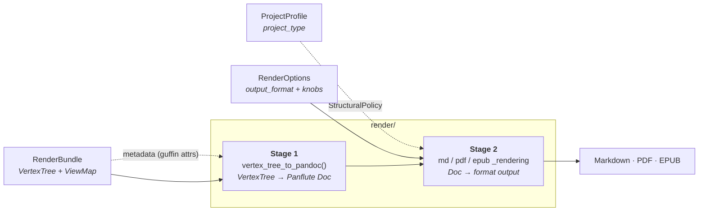

# Render pipeline & project types

How the **render** layer turns the normalized model into output, and where **project types**
(`book` vs. `article` vs. `manuscript`) fit into that.

This is the downstream companion to [processing_pipeline.md](processing_pipeline.md), which gives the
high-level overview of the whole pipeline and where the render layer sits among the sub-packages.
This doc goes deep on the *model → output* render layer and the project-type model layered on top of
it.

> Status note: the project-type model (`render/project.py`) is defined and **plumbed** — a
> `ProjectProfile` is threaded from the CLI `--type` flag through each render entry point. All three
> structural directives are applied in both formats: `top_level_division` (EPUB `--split-level`; PDF
> book mode — chapter page breaks + level-1 numbering), `number_sections`, and `emit_title_page`
> (PDF Bergfink `titlepage`; EPUB `--epub-title-page`). Bibliographic **metadata** is also applied —
> sourced from a root page's `guffin`-domain attributes (see Stage 1). `abstract` is **deferred
> indefinitely**. This doc describes both the current shape and the intended design. Sections that
> describe planned behavior are marked _(planned)_.

## The render layer is a two-stage pipeline

Every export format goes through the same two stages:

- **Stage 1 — `render/pandoc_rendering.py::vertex_tree_to_pandoc()`**: walks the `VertexTree`,
  batch-parses inline Pandoc Markdown, and builds a **format-neutral** Panflute `Doc` (the in-memory
  Pandoc AST). Shared by all formats.
- **Stage 2 — `render/{md,pdf,epub}_rendering.py`**: serializes the `Doc` to Pandoc JSON and invokes
  Pandoc (plus Typst for PDF), applying the **format-specific** writer, Lua filters, templates, and
  bundled resources.

## Three orthogonal inputs

A render call combines three independent things. They are kept as separate objects on purpose —
each is a different axis:

| Object | Question it answers | Module | Discriminator |
|---|---|---|---|
| `RenderBundle` | *what is the content?* | `model/render_bundle.py` | — |
| `ProjectProfile` | *what kind of work is it?* | `render/project.py` | `project_type` |
| `RenderOptions` | *how / where to output?* | `render/render_options.py` | `output_format` |

`RenderOptions` and `ProjectProfile` are **both** format-independent in their base, but that does not
make them the same kind of thing:

- `RenderOptions` base fields (`output_dir`, `cache_dir`, `dump_pandoc_ast`, `suppress_attributes`)
  are render-**operation** knobs — they only exist *because* you are rendering.
- `ProjectProfile` describes the **work itself** (its kind plus bibliographic identity), which is
  invariant across formats and across render operations. A book is a book whether you render it to
  PDF, to EPUB, or not at all.

### Why they are not merged

`output_format` (md/pdf/epub) and `project_type` (default/book/manuscript) cross-product
independently — a 3×3 space. Folding the profile into `RenderOptions` would either:

- **flatten the two discriminators** → one subclass per *combination* (`PdfBookOptions`,
  `EpubArticleOptions`, …): combinatorial explosion; or
- **nest `profile` as a field** of `RenderOptions` → a *format-specific* object would carry a
  *format-independent* thing, and rendering one work to two formats would mean specifying the
  profile twice and keeping the copies in sync.

Keeping them separate gives the correct cardinality: **one** `ProjectProfile`, **N** format options.

## Project types

`render/project.py` models the *kind of work*, adopting the **concept** from Quarto's
`project: type:` — but **no Quarto artifact**: no `_quarto.yml`, no `quarto` CLI, no extensions.
Just a native vocabulary and the structural semantics it implies, expressed as Guffin's own Pydantic
models (mirroring the `RenderOptions` discriminated-hierarchy pattern).

- `ProjectType` — `default` | `book` | `manuscript` (the discriminator).
- `ProjectProfile` — the format-independent base, with bibliographic fields
  (`title`, `authors`, `date`, `identifier`) shared by every kind of work. _Note:_ these fields are
  **not currently the metadata source** — bibliographic metadata is sourced from the content's
  `guffin`-domain attributes instead (see Stage 1), so the profile fields are presently unused (a
  possible future fallback/override).
- Per-type subclasses — `DefaultProfile`, `BookProfile` (`with_parts`),
  `ManuscriptProfile` (`abstract`, `keywords`).
- `StructuralPolicy` — the format-independent structural directives a profile **resolves to** (via
  `profile.structural_policy`). Renderers consume this rather than branching on `ProjectType`, so the
  type→structure semantics live in one place.

| `ProjectType` | top-level division | title page | numbered | abstract |
|---|---|---|---|---|
| `default` (article) | section | no | no | no |
| `book` | chapter (or part) | yes | yes | no |
| `manuscript` | section | yes | no | yes |

## Where the profile is consumed

In the **render layer only** — never in `transcribe/`. Two reasons:

1. **Conceptual.** Transcription is project-type-agnostic. It produces the same `VertexTree`
   regardless of how the work will later be packaged; the book-vs-article distinction is realized at
   render time (heading→division mapping, title page, numbering).
2. **Structural.** `ProjectProfile` lives in `render/`, and `transcribe/` may not depend on
   `render/` (sibling layers). So `transcribe/` *cannot* import it — it would invert the layering.

Within `render/`, the profile's effects split across the two stages.

### Stage 1 — metadata _(applied)_

The bibliographic metadata source is a root page's **`guffin`-domain attributes** — the attributes
folded from a `guffin-meta::` container block (the Guffin metadata convention). In
`vertex_tree_to_pandoc()`, `_document_metadata()` reads them and maps recognised names to
`doc.metadata`: `title` → title (**overriding** the Roam page title), `authors` → `author` (one
entry per value, so comma-separated authors become multiple), `date` → date, `identifier` →
identifier. Every Pandoc writer then maps the metadata to its format natively (Typst title block;
EPUB `dc:title` / `dc:creator` / `dc:date` / `dc:identifier`) — **the format renderers do not change
for this half.** Metadata-domain attributes never render as body pills, and any unrecognised
`guffin`-domain attribute is dropped from the output entirely. (`abstract` is deferred indefinitely.)

### Stage 2 — structure _(partially applied)_

The `StructuralPolicy` directives (`top_level_division`, `number_sections`, title page) are **not
representable in the Pandoc AST** — the AST has only `Header` elements with a level 1–6, no
"chapter," "numbered," or "title page" node. They are produced by the **writer + template at
invocation time**, and the mechanism differs per format:

| Policy directive | PDF (Typst / Bergfink) | EPUB (Pandoc) |
|---|---|---|
| chapters vs. sections | `-V top-level-division` → Bergfink book mode (Typst ignores `--top-level-division`) ✅ | `--split-level` ✅ |
| numbering | `-V number-sections=true` (Bergfink variable) ✅ | `--number-sections` ✅ |
| title page | `-V titlepage=true` → Bergfink `titlepage.typ` partial ✅ | `--epub-title-page=true\|false` ✅ |

So the structural half **cannot** be absorbed entirely into stage 1: the EPUB renderer
(`--split-level`) and the PDF path (a Bergfink template variable) each consult the policy. The
chapters-vs-sections distinction was the heaviest piece, since Bergfink had no chapter concept and it
had to be authored into the Typst template (below) rather than toggled with a flag.

The EPUB `--split-level` is wired: `epub_rendering._split_level_for()` maps `top_level_division` to a
Pandoc split level (valid range 1–6). Pandoc splits an EPUB into separate content files at the chosen
heading level, so the split must fall where a standalone "chapter" file begins. A book *with parts*
puts chapters at heading level 2 (parts occupy level 1) and therefore splits at level 2; every other
division keeps its top-level unit at level 1 and splits there. (Pandoc has no level-0 / "never split"
option, so an article and a book-without-parts produce the same level-1 chunking — the
section-vs-chapter distinction for those is a labelling/numbering concern, surfaced by later
increments rather than by chunking.)

`number_sections` is wired for both formats, but the lever differs: EPUB passes Pandoc's
`--number-sections` flag (the epub writer numbers headings directly), while PDF passes
`-V number-sections=true` — Bergfink reads numbering from its own `number-sections` variable, and
the `--number-sections` *flag* does not set it. Both derive the boolean from
`profile.structural_policy.number_sections`. On the PDF side the template-applying args are built
once by `pdf_rendering._typst_template_args()` and shared with the `GUFFIN_DUMP_TYPST` dump, so the
dumped Typst always matches the produced PDF.

`top_level_division` is wired for PDF too, modelled on the EPUB book output. When the division is not
`SECTION`, `pdf_rendering` passes `-V top-level-division=<chapter|part>`, which activates a book-mode
block in `bergfink.typst` (gated on that variable, so the default `SECTION` render emits no new Typst
and stays byte-identical). Book mode adds a `pagebreak(weak: true)` before every level-1 heading — so
chapters open on a new page, the print analogue of EPUB splitting each chapter into its own content
file — and, when numbering is on, overrides heading numbering with a hierarchical join
(`1`, `1.1`, `1.1.1`) starting at level 1, matching Pandoc's EPUB numbering. (The bundled
`user_cfg.typ` otherwise starts numbering at level 2, which is why an un-booked `--type book` PDF left
its top-level headings unnumbered.)

### Summary

| Profile data | Stage | Consumed in | Format renderers change? |
|---|---|---|---|
| `title`, `authors`, `date`, `identifier` (`guffin`-domain attributes) | 1 (metadata) ✅ | `pandoc_rendering._document_metadata` | no |
| `top_level_division`, `number_sections`, title page | 2 (structure) | `pdf` / `epub` renderers + Bergfink template | yes (minimal) |

## The `GuffinSemantics` vocabulary (model → format mapping)

> **Intent / roadmap.** The vocabulary below exists in `model/guffin_semantics.py`; the per-format
> mappings that consume it are not built yet. This section records the design so the mappings, when
> added, stay consistent with it.

`model/guffin_semantics.py` defines a **format-independent vocabulary aligned with publishing-industry
standards and conventions** — the semantic identity of the pieces of a document, independent of how
any output format renders them. It is intentionally *not* modeled on EPUB (or PDF, or GFM).

Each recognized attribute is a `GuffinAttribute` (an `Attribute` pinned to the `guffin` domain)
carrying two orthogonal descriptors:

- **`Role`** — `PUBLISHING` (a bibliographic/output-metadata fact) or `STRUCTURAL` (tags a document
  element with its structural function).
- **`Level`** — `DOCUMENT` (applies to the work as a whole) or `HEADER` (applies to one heading /
  section).

`GuffinSemantics` is the enum registry of these, in two groups:

| Group | Role / Level | Members |
|---|---|---|
| Publishing metadata | `PUBLISHING` / `DOCUMENT` | `TITLE`, `AUTHORS`, `DATE`, `IDENTIFIER` |
| Structural sections | `STRUCTURAL` / `HEADER` | `COVER`, `TITLE_PAGE`, `COPYRIGHT_PAGE`, `EPIGRAPH`, `ACKNOWLEDGEMENTS`, `FOREWORD`, `PREFACE`, `INTRODUCTION`, `TABLE_OF_CONTENTS`, `PART`, `CHAPTER`, `SECTION`, `SUB_SECTION`, `SUB_SUB_SECTION`, `CONCLUSION`, `EPILOGUE`, `AFTERWORD`, `APPENDICES`, `GLOSSARY`, `LIST_OF_ILLUSTRATIONS`, `ENDNOTES`, `BIBLIOGRAPHY`, `INDEX`, `ABOUT_THE_AUTHOR`, `COLOPHON` |

Member **names follow publishing labels** (`acknowledgements`, `appendices`, `table-of-contents`,
`list-of-illustrations`, `about-the-author`), which deliberately diverge from any one format's terms —
e.g. EPUB's Structural Semantics Vocabulary uses `acknowledgments`, `appendix`, `toc`, `loi`. That
divergence is by design: the model speaks the publishing domain, and the render layer translates.

### How it maps to output (the design contract)

- `GuffinSemantics`/`GuffinAttribute`/`Role`/`Level` live in `model/` with **zero render/format
  dependency**.
- Every per-format mapping lives in `render/`, as an **explicit map keyed on the `GuffinSemantics`
  member** — never a name-equality lookup against the format's own vocabulary. Some members will have
  no counterpart in a given format (and vice-versa), so the map is deliberately partial.
- **Short-term goal:** a `GuffinSemantics → EpubType` (`render/epub_semantics.py`) map drives EPUB
  structural rendering (e.g. `COLOPHON → EpubType.COLOPHON`, `INTRODUCTION → EpubType.INTRODUCTION`),
  stamping `epub:type` on section headers.
- **Long-term goal:** sibling maps (`→ PDF/Typst`, `→ GFM`) let the *same* authored tags drive every
  `export-roam-tree` output format.

## Status & next steps

1. **Plumbing — done.** `render/project.py` defines the model and `profile_for()` maps a
   `ProjectType` to its default-valued profile. The CLI exposes `--type default|book|manuscript`
   (parallel to `--format`, default `default`), and each render entry point
   (`render/{md,pdf,epub}_rendering.py::render`) now takes a `profile: ProjectProfile` argument,
   threaded through `cli/export_roam_tree.py::_render`. Nothing reads `StructuralPolicy` to shape
   output yet — the renderers currently only log it.
2. **Structural effects — done.** All three `StructuralPolicy` directives are applied, in both formats:
   - `top_level_division` → EPUB `--split-level` (`epub_rendering._split_level_for()`: a parts-based
     book splits at level 2, everything else at level 1) and PDF book mode (`bergfink.typst`: a page
     break before each level-1 chapter plus hierarchical level-1 numbering, mirroring EPUB).
   - `number_sections` → both formats (EPUB `--number-sections`; PDF `-V number-sections=true`).
   - `emit_title_page` → PDF Bergfink title page (`-V titlepage=true` → `titlepage.typ`, rendered
     from the document metadata) and EPUB `--epub-title-page=true|false` (Pandoc's metadata-driven
     title page). A `default` article emits none; a book/manuscript emits one.
3. **Bibliographic metadata — done.** A root page's `guffin`-domain attributes (title/authors/date/
   identifier, folded from a `guffin-meta::` block) populate the document metadata via
   `pandoc_rendering._document_metadata`; `title` overrides the page title and the rest map to the
   writer's native metadata (Typst title block, EPUB `dc:*`). These never render as body pills.
4. **Possible refinements.** Distinguish PART from CHAPTER in PDF book mode (currently both just
   page-break and number from level 1). (`abstract` is deferred indefinitely.)
