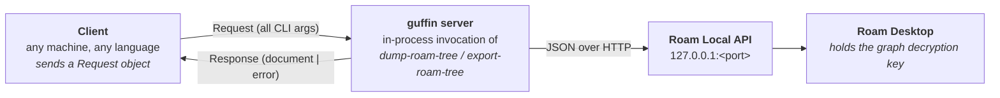
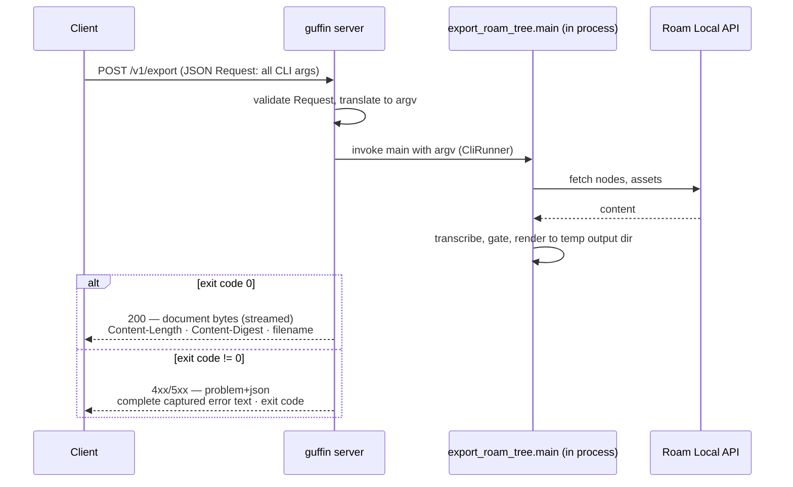

# Guffin server mode

**Status: Phase 1 (the synchronous v1) is implemented** — the `server/` sub-package, the
`guffin-server` launcher (binding `127.0.0.1:8077` by default), and the offline + live test
tiers; phases 2–3 remain planned. This is the working design document for *server mode*:
remote, RPC-like invocation of the two existing commands, `dump-roam-tree` and
`export-roam-tree`. It records the requirements, the protocol evaluation, the API design, the
in-process invocation design, and the decision log.

Companion docs: [processing_pipeline.md](processing_pipeline.md) (what the commands do),
[roam-local-api.md](roam-local-api.md) (why the server must live next to Roam Desktop).


## Why a server

For an encrypted graph, Roam content is reachable only through the **Roam Local API**, which
listens on `127.0.0.1` of the machine running Roam Desktop (see
[roam-local-api.md](roam-local-api.md)). Today guffin's commands must therefore run in a shell
*on that machine*. Server mode turns that machine into a document service: any client — another
machine, an automation, an editor integration — can request a dump or an export over the network
and receive the rendered document back.



The colocation is a hard constraint, not a choice: the server process must run on the host where
Roam Desktop runs, because that is the only place the Local API answers.


## Requirements

Stated requirements (the phase's charter):

- **R1 — Standard protocol.** Once launched, the server listens for incoming work requests using
  a very well standardized RPC-like protocol.
- **R2 — Request carries the CLI vocabulary.** The client initiates a request carrying everything
  that is today a command-line argument, as a structured *Request* object.
- **R3 — In-process invocation.** The server invokes `dump_roam_tree.main` or
  `export_roam_tree.main` *in process* — no shell-out, no subprocess — with the command-line
  arguments.
- **R4 — Response dichotomy.** The *Response* object contains exactly one of:
  the document/rendering (no errors occurred), or the complete error message the invocation
  generated.
- **R5 — Synchronous v1.** The client call is blocking (strictly synchronous) for starters.
- **R6 — Large payloads.** The protocol must transfer large response documents (10–100 MB)
  efficiently and very reliably.

Derived requirements (implied by the codebase and the deployment shape):

- **R7 — Defined payload per command.** "The document" must be pinned down per command × format:
  a Markdown `--bundle` export produces a *directory* (`.mdbundle/`), and `dump-roam-tree`
  produces terminal output, not a file. See *What travels back* below.
- **R8 — Complete error capture.** Both commands report failures as `logger.error(...)` lines
  followed by an exit with code 1 — the "complete error message" is therefore the captured
  per-request log output plus any traceback and the exit code, not merely an exception string.
- **R9 — Secrets stay secret.** The Roam bearer token travels inside the Request. It must never
  be logged (the CLI already filters it via `_SECRET_PARAMS` / `ApiEndpoint`'s `SecretStr`), and
  the transport story must acknowledge it (see *Security*).
- **R10 — Behaviour parity.** A request with a given set of arguments must behave exactly as the
  same arguments would at a terminal — same defaults, same env-var fallbacks, same content gates
  and strictness postures. The CLI declaration stays the single source of truth for parameter
  semantics; the server derives from it rather than duplicating it.


## The v1 dialog



The response begins only after the invocation has fully completed and the output file exists on
disk. That render-then-send rule is what keeps R4's dichotomy clean: a request can never receive
half a document and then an error — the status line already said which of the two it is getting.


## What travels back

| Command | Invocation output today | v1 response payload | Media type |
|---|---|---|---|
| `export-roam-tree --format pdf` | `<stem>.pdf` file | the file's bytes | `application/pdf` |
| `export-roam-tree --format epub` | `<stem>.epub` file | the file's bytes | `application/epub+zip` |
| `export-roam-tree --format markdown --no-bundle` | `<stem>.md` file | the file's bytes | `text/markdown` |
| `export-roam-tree --format markdown --bundle` | `<stem>.mdbundle/` **directory** | a zip archive of the directory | `application/zip` |
| `dump-roam-tree` | Rich rendering to the terminal | the captured console rendering, in the requested representation | `text/plain; charset=utf-8` · `text/html` · `image/svg+xml` |

Rules:

- **Exactly one artifact per response.** Ancillary outputs (`--dump-pandoc-ast`'s
  `<stem>.pandoc.json`, `GUFFIN_DUMP_TYPST`'s `.typ` sources) are server-side debug files and are
  *not* returned; the flags are accepted but their outputs stay on the server.
- **The `.mdbundle` directory zips.** A directory cannot be a single response body; the archive
  preserves the bundle's internal layout so unzipping yields exactly what the CLI would have
  written.
- **A dump is a console rendering, in one of three representations.** The Rich rendering is
  captured server-side and returned in the representation the request selects
  (`console_format`): plain text (the default; ANSI escapes opt-in via `ansi`), standalone HTML,
  or SVG — Rich's own `export_text` / `export_html` / `export_svg`. Width is a request field
  too, since Rich otherwise wraps at a non-tty default (see *Dump-specific request fields*).


## Protocol selection

### What the protocol must provide

1. Standardized and boring — mature spec, first-class tooling, clients in every language (R1).
2. RPC shape — a named operation with structured, typed arguments (R2).
3. Strict request/response — a blocking call fits it naturally (R5).
4. Efficient large binary responses — 10–100 MB with no encoding inflation and without buffering
   whole documents in memory (R6).
5. Reliable — truncation and corruption detectable end-to-end (R6).
6. A good fit for this codebase — Pydantic-first models, pyright strict, no generated `Any`-laden
   stubs.

### Candidates

| Candidate | Verdict | Why |
|---|---|---|
| **HTTP command endpoints** — JSON request, binary streaming response (FastAPI/uvicorn) | **Recommended** | HTTP is the most standardized RPC substrate in existence; large binary transfer is its core competency (streamed bodies, `Content-Length`, `Content-Digest`); request models are ordinary Pydantic; OpenAPI schema and `curl`-ability for free |
| gRPC (protobuf over HTTP/2) | Rejected for v1 | Its own best practice caps unary messages (~4 MiB default inbound limit) and steers 100 MB payloads to chunked *streaming* RPCs — exactly the complexity R5 defers; protobuf codegen fights the house Pydantic/pyright-strict style; harder to debug on the wire |
| Connect RPC | Rejected for v1 | The nicest gRPC-compatible option (plain HTTP/1.1 POST), but the Python server ecosystem is young; revisit if multi-protocol clients ever matter |
| JSON-RPC 2.0 | Rejected | Standardized and simple, but has no binary payload story: a 100 MB PDF becomes ~133 MB of base64 inside a JSON document that must be materialized and parsed whole |
| XML-RPC | Rejected | Stdlib, but archaic; same base64 inflation |
| ZeroMQ / Thrift / Cap'n Proto | Rejected | Message-queue or IDL-codegen machinery with none of HTTP's ubiquity; wrong trade for two operations |

### Recommendation

**HTTP/1.1 command endpoints: `POST` a JSON Request, receive either the document as a streamed
binary body or a structured error.** Concretely:

- **Server**: FastAPI on uvicorn (new dependencies: `fastapi`, `uvicorn`; `httpx` for test
  clients). Request bodies are Pydantic models — the same modeling idiom as the rest of the
  package, validated at the boundary (parse-don't-validate).
- **Success**: `200` with the document bytes as the body, streamed from disk in chunks (constant
  memory), with `Content-Type` (per the table above), `Content-Length`,
  `Content-Disposition: attachment; filename*=` carrying the CLI-deduced filename
  (e.g. `Foo.book.pdf`), and `Content-Digest: sha-256=...` ([RFC 9530]) so the client can verify
  integrity end-to-end.
- **Failure**: an error status with an `application/problem+json` body ([RFC 9457]) carrying the
  complete captured error text (R8).
- **Reliability** (R6): the render completes before the response starts, so the status code is
  authoritative; `Content-Length` makes truncation detectable (HTTP clients raise on a short
  body); the SHA-256 `Content-Digest` makes corruption detectable; requests are idempotent, so a
  client may simply retry.
- **"RPC-like"**: one endpoint per command, verbs in the path, all arguments in one request
  object — the command pattern over HTTP POST. OpenAPI (generated by FastAPI) is the interface
  definition; any language speaks it.
- **Why HTTP/1.1, not HTTP/2**: h2's efficiencies — stream multiplexing, HPACK header
  compression, prioritization — pay off for many small concurrent exchanges, the opposite of
  this workload's one large sequential body per strictly-synchronous request. On a single stream
  h2 *adds* cost: DATA-frame framing, plus its own two-layer flow control whose 64 KiB default
  windows are the classic untuned-large-transfer throttle (stalling on `WINDOW_UPDATE` round
  trips instead of letting TCP run). With `Content-Length` known up front, an h1.1 body is the
  raw TCP stream after the headers — nothing to tune, `curl`/`tcpdump` debuggable. h2 would also
  drag in TLS in practice (cleartext h2c has poor client support) and a different ASGI server
  (uvicorn speaks only h1.1). None of this is a one-way door: the contract is HTTP *semantics*
  (RFC 9110), identical over h1.1/h2/h3, so fronting the server later with an h2/h3-terminating
  proxy — sensible once phase-3 concurrency gives multiplexing something to do — changes nothing
  in the API.

Ratified 2026-07-29 — see *Decisions*.

[RFC 9457]: https://www.rfc-editor.org/rfc/rfc9457
[RFC 9530]: https://www.rfc-editor.org/rfc/rfc9530


## API sketch

### Endpoints

| Endpoint | Maps to | Success body |
|---|---|---|
| `POST /v1/export` | `export_roam_tree.main` | the exported document (binary, streamed) |
| `POST /v1/dump` | `dump_roam_tree.main` | the captured console rendering (text) |
| `GET /v1/health` | — | liveness + server version/provenance (no Roam connectivity probe: that needs a graph + token, which health checks don't carry) |

### Request models

One Pydantic model per endpoint, **derived from the Typer command signature at import time**
(decided — see *Decisions*): the server introspects the command function's parameters and builds
each model with `pydantic.create_model` — field name = parameter name, field type = the
parameter's underlying type, and the `typer.Option` metadata carried on the `Annotated`
annotation supplying the flag spellings for the argv translation (including the paired
`--x/--no-x` boolean forms) and the help text for the OpenAPI field description. One
declaration — the CLI signature — thus yields the terminal interface, the request model, the
argv translation, and the OpenAPI docs; the vocabularies cannot drift. The cost is acknowledged:
dynamically created models are opaque to pyright (no statically known fields), so the harness
treats them generically — iterate fields, emit argv — and tests characterize each derived shape
against its command signature.

Every field except `target` is optional; an omitted field contributes no argv token, so the
Typer default — including its env-var fallback (`GUFFIN_ROAM_LOCAL_API_PORT`,
`GUFFIN_ROAM_GRAPH_NAME`, …) resolved in the *server's* environment — applies exactly as at a
terminal (R10). A server colocated with Roam Desktop can thus hold the connection settings in
its environment, and clients send only `target` plus whatever they want to override.

The derivation takes two per-endpoint adjustments, both deliberate divergences from the CLI:

- **`output_dir` is absent from `ExportRequest`.** A remote client has no business naming a
  server path. The server allocates a per-request temporary output directory, sends the artifact
  back from it, and deletes it after the response completes. (`cache_dir` and `template_dir`
  remain available but name *server-side* paths; they are deployment configuration more than
  request parameters, and a later phase may constrain them to a server-configured allowlist.)
- **Dump-specific request fields** (no CLI counterpart): `console_format` (`text`/`html`/`svg`,
  default `text`) selecting the response representation, `console_width` (int, default 120), and
  `ansi` (bool, default false; meaningful for `text` only — `html`/`svg` carry styling
  inherently), applied via Rich's recording/export machinery and the `COLUMNS` environment it
  honors, so a dump renders at the client's desired width and fidelity rather than a non-tty
  default.

Example — the JSON Request and the argv it deterministically translates to:

```json
{
  "target": "[[Test Article]] 6",
  "output_format": "epub",
  "project_type": "book",
  "numbering": false
}
```

```
export-roam-tree "[[Test Article]] 6" --format epub --type book --no-numbering
```

### Error contract

Any invocation that exits non-zero (or raises) maps to a problem+json response:

| Status | Meaning |
|---|---|
| `400` | The Request object itself is malformed (Pydantic validation failure) |
| `422` | The invocation ran and failed — target not found, semantics-gate violation, code-source verification failure, render error (today's exit-code-1 paths) |
| `500` | The server itself faulted (a bug in the harness, not in the invocation) |

Problem body: `type`, `title`, `status`, `detail` (the **complete** captured error text: every
log record emitted during the invocation, plus the traceback when one exists), and extensions
`exit_code`, `command`, `target`. Today all invocation failures collapse to exit code 1, so v1
does not attempt finer status mapping; if the CLI ever grows distinct exit codes, the mapping can
refine without breaking clients.


## In-process invocation

R3 says *invoke `main` in process with the command-line arguments*. Three mechanisms were
considered:

1. **`typer.testing.CliRunner` (recommended).** The server translates the validated Request into
   an argv vector and invokes the Typer app in process. This is the highest-fidelity reading of
   R3: Typer's own parsing, defaults, and env-var resolution run exactly as at a terminal (R10),
   `typer.Exit` is absorbed into a structured `exit_code`, and stdout (the dump's Rich rendering)
   is captured for us. The CLI remains the single source of truth; the server adds no second
   orchestration layer to keep in sync. Cost: `CliRunner` lives in a `testing` module (it wraps
   Click's stable, public `click.testing.CliRunner`) — accepted for v1.
2. **Direct call of the command function** with typed kwargs. Typed and explicit, but it bypasses
   Typer's env-var resolution (Python signature defaults would silently replace `GUFFIN_*`
   fallbacks — a parity break with R10) and must hand-handle `typer.Exit`.
3. **Extract a front-end-agnostic orchestration layer** that both the CLI and the server call.
   The cleanest end state, but a refactor R3 explicitly does not ask for. Noted as the structural
   direction if a third front end ever appears.

Supporting mechanics:

- **Log capture (R8).** A per-request `logging.Handler` is attached for the duration of the
  invocation and detached after; its records become the `detail` of an error response. The
  bearer token never appears in them (R9 — already guaranteed by the CLI's `_SECRET_PARAMS`
  filtering and `ApiEndpoint`'s `SecretStr`). With v1's serialized execution (below) a plain
  root-handler swap suffices; concurrency later needs contextvars-scoped filtering.
- **Warnings on success.** `dump-roam-tree` treats gate findings as advisory warnings — they are
  log records, not part of the captured stdout. v1 returns only the document/rendering on
  success (decided — see *Decisions*); surfacing captured warnings alongside a successful
  payload (a multipart response or a JSON envelope mode) is phase-2 work.
- **Dump representations.** `dump_trees` prints through its own `Console`, so the harness
  captures the dump as ANSI text (`FORCE_COLOR` on for `html`/`svg`, and per the `ansi` field
  for `text`) and, for `html`/`svg`, re-renders the capture through a recording console —
  `Text.from_ansi` → `export_html` / `export_svg`. Zero changes to the command itself; if the
  ANSI round-trip ever loses fidelity, the fallback is a small injectable-console hook in
  `dump_trees`.


## Architecture placement

A new **`server/` sub-package** (`src/guffin/server/`) homes the ASGI app, the request/response
models, and the invocation harness. Its launcher — a `guffin-server` console script with
`--host`/`--port` options — is a Typer command in `cli/` (CLI isolation: Typer stays in `cli/`),
which starts uvicorn on the app object.

This requires amending the sub-package dependency rules:

| Package | May depend on | May NOT depend on |
|---|---|---|
| `server/` | `common/`, `roam/`, `model/`, `guffin` root modules, `transcribe/`, `render/`, **`cli/` (the command modules only)** | — |
| `cli/` | everything it may today, plus `server/` (the launcher only) | — |

Two acknowledged tensions, both accepted for v1:

- **`server/` → `cli/` breaks "no package depends on `cli/`".** That rule's intent is that
  *library* packages never depend on a front end. `server/` is not a library — it is a peer
  front end whose charter (R3) is precisely to invoke the CLI's entry points in process. The
  rule becomes: no *library* package may depend on `cli/` or `server/`.
- **`cli/` ↔ `server/` is a package-level cycle.** It is module-level acyclic: `cli/serve.py`
  (the launcher) imports `server/app.py`; `server/app.py` imports `cli/export_roam_tree.py` and
  `cli/dump_roam_tree.py`; nothing in `server/` imports the launcher. The eventual extraction of
  a shared orchestration layer (mechanism 3 above) dissolves the cycle; until then
  `tests/test_architecture.py` should pin the module-level shape.

Exit-point isolation extends naturally: the harness *absorbs* `typer.Exit` into a Response — it
never raises one — and the only process-exit in `server/`'s orbit remains the launcher in `cli/`.


## Security

- **Bind `127.0.0.1` by default.** Exposing the server beyond the host is an explicit
  `--host 0.0.0.0` decision by the operator.
- **The bearer token rides in request bodies** (R9). Plain HTTP is acceptable only on a trusted
  path (localhost, an SSH tunnel, a tailnet). For anything else, terminate TLS in front of the
  server. v1 ships no auth of its own; an API-key header is the obvious phase-2 addition.
- **Server-side path fields** (`cache_dir`, `template_dir`) let a request name arbitrary server
  paths. v1 accepts this within the trusted-operator model; the hardening path is a
  server-configured allowlist (named template sets rather than raw paths).
- **No secrets in logs** — already enforced upstream; the per-request log capture inherits it.


## Concurrency (v1)

**One invocation at a time.** Requests are accepted concurrently but executed serially behind an
in-process lock. Reasons: the commands were written as single-run processes (module-level logging
configuration, env-var reads, a process-wide `pandoc-server` opt-in); dump width/colour control
works via process environment; and every request funnels into one Roam Desktop anyway, which is
the real throughput ceiling. Long renders block later requests — acceptable under R5's
strictly-synchronous charter. Clients must set generous read timeouts (renders that fetch assets
and run Typst can take minutes); the async job API is the phase-3 answer, not a bigger worker
pool.


## Testing plan

- **Offline endpoint tests** (`tests/server/`): FastAPI's `TestClient` against the app with the
  fetch pipeline fed from recorded fixtures — the `TestExportRoamTreeMdbundleFromRaw` pattern
  (render a recorded `raw_result` end to end, no Roam, no Firestore). Covers the request→argv
  translation, the response dichotomy, header correctness (`Content-Length`, `Content-Digest`,
  `Content-Disposition`), the mdbundle zip layout, and the error contract for each failure class
  (not-found, semantics violation, render error).
- **Harness unit tests**: request-model derivation (one field per command parameter, exclusions
  and extras applied, types preserved), argv translation (every request field → its flag,
  omitted → absent, boolean pair forms), log capture attach/detach, `typer.Exit` absorption,
  dump representation round-trip (ANSI capture → HTML/SVG export).
- **Live tier** (`GUFFIN_LIVE_TESTS=1`, marked `live`): boot the real server, export a Test
  Article over real HTTP, byte-compare against the recorded baseline, verify the digest header.


## Plan

**Phase 1 — the synchronous v1 (implemented):**

1. `server/` sub-package: request models derived from the Typer command signatures, invocation
   harness (CliRunner + log capture + dump representations), ASGI app with `/v1/export`,
   `/v1/dump`, `/v1/health`.
2. Response machinery: temp output dirs, mdbundle zipping, streamed responses with
   length/digest/disposition headers, problem+json errors.
3. `guffin-server` launcher in `cli/`; dependency-rule amendment + architecture-test update.
4. Offline + live tests per the testing plan; docs updated (this file becomes the reference).

**Phase 2 — operational hardening:** API-key auth; TLS deployment guidance; captured warnings
surfaced on success responses; named template sets replacing raw server paths; request/response
logging with correlation ids.

**Phase 3 — beyond strictly synchronous:** async job API (submit → poll → fetch) for long
renders, progress reporting, cancellation, resumable downloads (`Range`), bounded concurrency if
Roam Desktop tolerates it.


## Decisions

Resolved 2026-07-29:

- **Protocol**: HTTP command endpoints — JSON Request in, streamed binary response out — per the
  *Protocol selection* recommendation. gRPC remains the noted fallback if protobuf-defined
  contracts across many client languages ever become a requirement.
- **Launcher name**: `guffin-server`.
- **Endpoint naming**: `/v1/export` + `/v1/dump` (short verbs, not the full command names).
- **Warnings on success**: v1 loses advisory warnings (dump's gate findings) on a success
  response; surfacing them (multipart or a JSON-envelope mode) is phase-2 work.
- **Request-model derivation**: the request models are derived from the Typer command
  signatures at import time — no hand-written mirror (see *Request models*).
- **Dump representations**: the dump endpoint exploits Rich's export formats — `text`
  (default), `html`, and `svg`, selected per request via `console_format`.

Nothing remains open.
