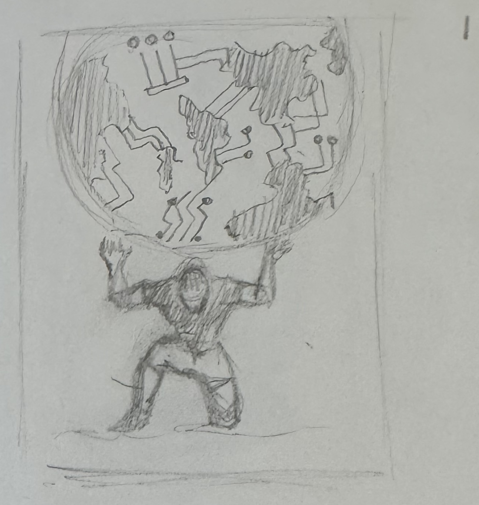
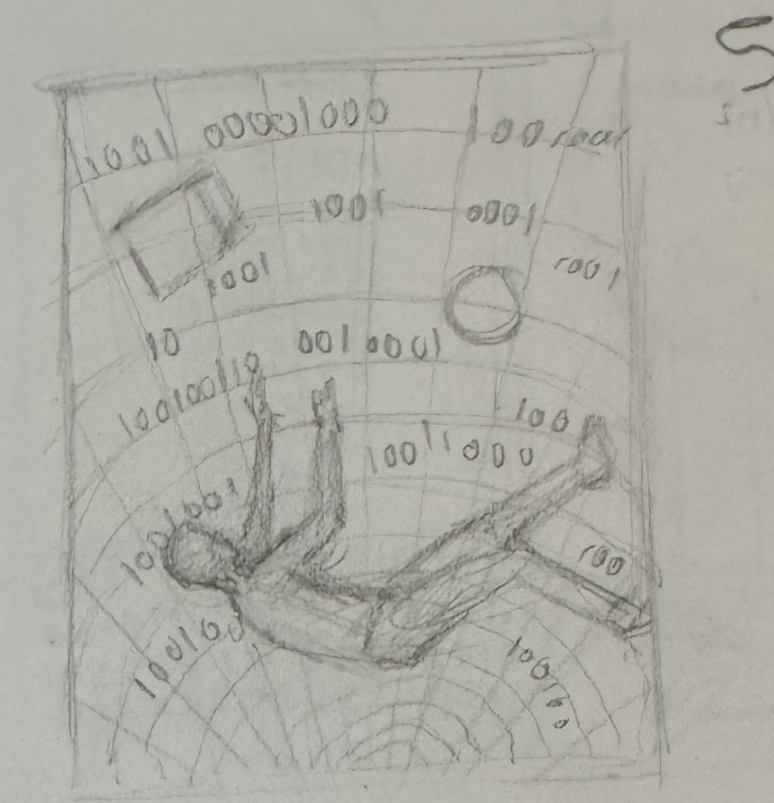
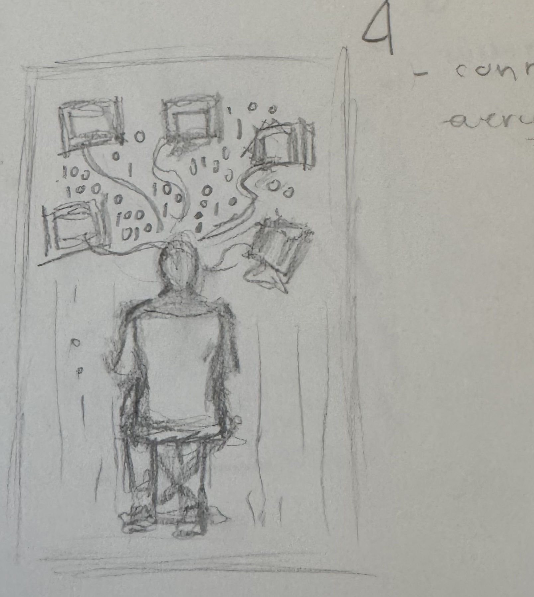

# Test Article 1

> [!NOTE]
> **THIS PAGE IS USED FOR TESTING [GUFFIN](https://github.com/jpanico/guffin) – DO NOT REMOVE**
>
> Features:
>
> - Page is completely self-contained – there are `no Roam embeds` of any kind
> - 3 top-level `headers`, all H1
> - nested `headers` down to H4, via *Augmented Headings* extension
> - a node, (Ma5KGUH9O) “AI assistant (Claude Opus 4.6):” that has property: BLOCK_HEADING = 0, which is not a valid Markdown level. It seems that this can happen when first a valid level value (1-6) is assigned, and then the heading level is removed altogether through the Roam UI.
> - a pair of JPEG `image`s that **have not** been resized through the Roam UI (illustration 1.1)
> - a single JPEG `image` that **has** been resized through the Roam UI (illustration 2.1)
> - a native `{{table}}` (Section 2.2) whose four cells are each a standalone `block reference` to a JPEG `image` block, so each cell displays its referenced image
> - an embedded PDF document that has no special PublishingSemantics Attributes attached
> - an embedded PDF document that has `guffin-meta:: pdf-render: "inline"`
> - this INFO `Callout box`, which contains Roam `page references`

## Section 1

### Section 1.1

#### illustration 1.1

- this image **has not been resized** through the Roam UI.
  

- AI assistant (Claude Opus 4.6):

## Section 2

### Section 2.1

#### illustration 2.1

- this image **has been resized** through the Roam UI (width:257, height:None)

#### asset 2.1

- an asset is a BLOB stored by Roam in Cloud Firestore; usually a file dragged into the Roam UI. The Roam Markdown representation of the asset is just the Cloud Firestore URL.
- https://firebasestorage.googleapis.com/v0/b/firescript-577a2.appspot.com/o/imgs%2Fapp%2FSCFH%2FfJoSdh65Ry.pkpass.enc?alt=media&token=b756b61a-8d04-4f30-a887-3feac7bb9d6a

#### Section 2.1.1

##### Section 2.1.1.1

### Section 2.2

|  |  |
|----|----|
|  |  |

## Section 3

### Section 3.1

- the following block contains the canonical w3.org “Dummy” PDF file: https://www.w3.org/WAI/ER/tests/xhtml/testfiles/resources/pdf/dummy.pdf

- [dummy.pdf](dummy.pdf "dummy.pdf")

### Section 3.2

- the following block embeds a PDF with guffin-meta:: pdf-render: “inline”

dummy.pdf
